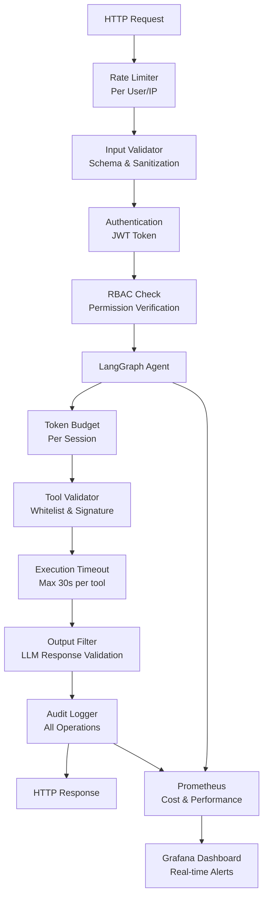

# Production-Grade Guardrails Architecture

This document provides a comprehensive guide to implementing guardrails in Dyno-Agent, protecting against cost overruns, security vulnerabilities, and system abuse while maintaining performance and user experience.

## Why Guardrails Matter

Guardrails are **critical safety mechanisms** for production AI systems:
- **Cost Control**: Prevent runaway LLM costs through token budgets and monitoring
- **Security**: Validate inputs/outputs and enforce access controls
- **Stability**: Prevent resource exhaustion and infinite loops
- **Compliance**: Audit sensitive operations and maintain regulatory requirements

## Guardrails Architecture Overview



---

## Implementation Roadmap

### Phase 1: HTTP Layer Guardrails (Week 1-2)

**Location**: `app/middleware/`

#### 1.1 Rate Limiting Middleware

**Why this approach?**
- Prevents DDoS attacks and resource exhaustion
- Protects LLM API quota from being depleted by single user
- Standard industry practice for public APIs
- Can be configured per endpoint and per user

**Technology choice**: `slowapi` library
- Built on top of `limits` library (battle-tested)
- Native FastAPI integration (decorators on routes)
- Redis support for distributed rate limiting (important for multi-instance deployment)
- Per-IP, per-user, per-path granular control

**Where to use it**: 
- `POST /chat/stream` - Most critical (10 req/min per conversation)
- `POST /auth/login` - Brute force protection (5 req/min per IP)
- `POST /allocate` - Protect allocation endpoint (20 req/min per user)

**Create file**: `app/middleware/rate_limit.py`

```python
# app/middleware/rate_limit.py
from slowapi import Limiter
from slowapi.util import get_remote_address
from slowapi.errors import RateLimitExceeded
from fastapi import Request
from prometheus_client import Counter

limiter = Limiter(
    key_func=get_remote_address,
    storage_uri="redis://localhost:6379",  # Use Redis for distributed systems
    default_limits=["100/minute"]  # Global default
)

# Metric for monitoring
rate_limit_exceeded_counter = Counter(
    'guardrails_rate_limit_exceeded_total',
    'Total rate limit violations',
    ['endpoint', 'user_id']
)

def custom_rate_limit_exceeded(request: Request, exc: RateLimitExceeded):
    """Custom handler for rate limit exceeded"""
    user_id = getattr(request.state, 'user_id', 'anonymous')
    rate_limit_exceeded_counter.labels(
        endpoint=request.url.path,
        user_id=user_id
    ).inc()
    
    return {
        "error": "Rate limit exceeded",
        "retry_after": int(exc.args[0].split("at")[-1]) if exc.args else 60
    }
```

**How to integrate in main.py**:

```python
# app/main.py
from fastapi import FastAPI
from slowapi.errors import RateLimitExceeded
from app.middleware.rate_limit import limiter, custom_rate_limit_exceeded

app = FastAPI()

# Add rate limiting
app.state.limiter = limiter
app.add_exception_handler(RateLimitExceeded, custom_rate_limit_exceeded)

# Apply to specific routes in app/routers/chat.py
from slowapi import Limiter

@router.post("/stream")
@limiter.limit("10/minute")  # 10 requests per minute per IP/user
async def chat_stream(request: ChatRequest):
    """Chat with AI agent with rate limiting"""
    pass
```

**Metrics to Track**:
- `guardrails_rate_limit_exceeded_total` - Counter of rejected requests
- Prometheus label: `[endpoint, user_id]` - Know which endpoints/users hit limits

---

#### 1.2 Input Validation Middleware

**Why this approach?**
- Prevents SQL injection, XSS, and prompt injection attacks at entry point
- Fails fast before reaching agent/database
- Pydantic provides automatic OpenAPI documentation
- Type safety reduces entire categories of bugs

**Technology choice**: Pydantic v2
- Built into FastAPI (no extra dependency)
- Automatic JSON schema validation
- Custom validators for business logic
- Better performance than manual validation

**Where to use it**:
- ALL endpoint requests (enforced automatically by FastAPI)
- Create schemas in `app/schemas/` for each endpoint
- Reuse across endpoints to maintain consistency

**Create file**: `app/schemas/chat.py` (modify existing if needed)

```python
# app/schemas/chat.py
from pydantic import BaseModel, field_validator, Field
from typing import Optional
import re

class ChatRequest(BaseModel):
    """Validated chat request with guardrails"""
    message: str = Field(
        ..., 
        min_length=1, 
        max_length=5000,
        description="User message (1-5000 chars)"
    )
    conversation_id: int = Field(
        ..., 
        gt=0, 
        description="Conversation ID (must be > 0)"
    )
    temperature: Optional[float] = Field(
        0.7, 
        ge=0.0, 
        le=1.0,
        description="LLM temperature (0.0-1.0)"
    )
    
    @field_validator('message')
    @classmethod
    def validate_message(cls, v: str) -> str:
        """Validate message content"""
        # Trim whitespace
        v = v.strip()
        
        # Prevent SQL injection patterns
        sql_patterns = [
            r"(?i)(drop|delete|truncate|union|select).*(?i)(from|where)",
            r"(?i)execute\s*\(",
        ]
        for pattern in sql_patterns:
            if re.search(pattern, v):
                raise ValueError("Message contains suspicious SQL patterns")
        
        # Prevent script injection
        if "<script>" in v.lower() or "javascript:" in v.lower():
            raise ValueError("Message contains script injection attempt")
        
        # Prevent prompt injection (common attack on LLMs)
        prompt_injection_patterns = [
            r"(?i)ignore.*previous.*instructions",
            r"(?i)pretend.*you.*are",
            r"(?i)system.*prompt",
        ]
        for pattern in prompt_injection_patterns:
            if re.search(pattern, v):
                raise ValueError("Message appears to be prompt injection attempt")
        
        return v
    
    @field_validator('conversation_id')
    @classmethod
    def validate_conversation_id(cls, v: int) -> int:
        """Validate conversation exists and belongs to user"""
        # This will be checked later in route handler using database
        # Here we just validate the range
        if v < 1 or v > 2147483647:  # Max int32
            raise ValueError("Invalid conversation ID")
        return v

class ChatResponse(BaseModel):
    """Validated response"""
    message: str
    tokens_used: int
    cost: float
```

**How to integrate in routes**:

```python
# app/routers/chat.py
from fastapi import APIRouter, Depends, HTTPException
from app.schemas.chat import ChatRequest, ChatResponse
from app.auth.auth_bearer import get_current_user

router = APIRouter(prefix="/chat", tags=["chat"])

@router.post("/stream")
async def chat_stream(
    request: ChatRequest,  # Automatically validated by Pydantic
    current_user: User = Depends(get_current_user),
    db: AsyncSession = Depends(get_db),
) -> ChatResponse:
    """
    Chat with AI agent.
    
    FastAPI automatically:
    - Validates JSON matches ChatRequest schema
    - Returns 422 if validation fails
    - Generates OpenAPI documentation
    """
    
    # By this point, we know:
    # - request.message is 1-5000 chars, no SQL/XSS/prompt injection
    # - request.conversation_id is valid range
    
    # Still need to verify user owns conversation (in handler)
    conversation = await db.get(Conversation, request.conversation_id)
    if not conversation or conversation.user_id != current_user.id:
        raise HTTPException(status_code=403, detail="Not authorized")
    
    # Safe to proceed
    return await process_chat(request, current_user, db)
```

**Metrics to Track**:
- `guardrails_input_validation_failed_total` - Counter of rejected inputs
- `guardrails_input_size_bytes` - Histogram of input sizes
- Prometheus labels: `[endpoint, reason]` - Know why validation failed

---

### Phase 2: Authentication & RBAC (Week 2-3)

**Location**: `app/auth/`

**Why this approach?**
- Current system uses JWT but lacks role/permission structure
- RBAC allows fine-grained control (who can allocate, modify, delete)
- Scalable: add new permissions without code changes
- Audit trail: track who did what

**Technology choice**: JWT + In-database roles
- JWT for stateless authentication (already in project)
- Database for role/permission management (allows dynamic updates)
- No external services needed (cost-effective for startup)

**Design Pattern**: 
- Roles (coarse-grained): USER, POWER_USER, ADMIN
- Permissions (fine-grained): allocate:vehicle, view:dynos, etc
- Mapping table: role → permissions (many-to-many)

#### 2.1 Database Schema for RBAC

**Create migration**: `app/migrations/versions/xxx_add_rbac.py`

```python
# This migration adds RBAC tables

def upgrade():
    # Table for roles
    op.create_table(
        'role',
        sa.Column('id', sa.Integer(), primary_key=True),
        sa.Column('name', sa.String(50), unique=True),  # USER, POWER_USER, ADMIN
        sa.Column('description', sa.String(255)),
    )
    
    # Table for permissions
    op.create_table(
        'permission',
        sa.Column('id', sa.Integer(), primary_key=True),
        sa.Column('name', sa.String(100), unique=True),  # view:dynos, allocate:vehicle
        sa.Column('description', sa.String(255)),
        sa.Column('category', sa.String(50)),  # tool, admin, view
    )
    
    # Many-to-many: roles have permissions
    op.create_table(
        'role_permission',
        sa.Column('role_id', sa.Integer(), sa.ForeignKey('role.id')),
        sa.Column('permission_id', sa.Integer(), sa.ForeignKey('permission.id')),
        sa.PrimaryKeyConstraint('role_id', 'permission_id'),
    )
    
    # Users have roles
    op.add_column('user', sa.Column('is_active', sa.Boolean(), default=True))
    op.create_table(
        'user_role',
        sa.Column('user_id', sa.Integer(), sa.ForeignKey('user.id')),
        sa.Column('role_id', sa.Integer(), sa.ForeignKey('role.id')),
        sa.Column('assigned_at', sa.DateTime(), default=datetime.utcnow),
        sa.PrimaryKeyConstraint('user_id', 'role_id'),
    )
```

**Run migration**: `make migrate` or `alembic upgrade head`

#### 2.2 Enhanced JWT Claims

**Modify**: `app/auth/auth_handler.py`

```python
# app/auth/auth_handler.py
from datetime import datetime, timedelta
from typing import List
import jwt
import uuid

SECRET_KEY = os.getenv("SECRET_KEY")
ALGORITHM = "HS256"

async def create_access_token(
    user_id: int, 
    email: str, 
    roles: List[str]
) -> str:
    """
    Create JWT with roles and permissions.
    
    Claims include:
    - sub: user ID (standard JWT)
    - email: user email
    - roles: list of role names for client-side caching
    - session_id: unique for audit logging
    - iat/exp: standard timing
    
    Why include roles in JWT?
    - Reduces database queries (client-side permission check)
    - Avoids N+1 problem on every request
    - Trade-off: role changes have ~5 min latency (acceptable)
    """
    payload = {
        "sub": str(user_id),
        "email": email,
        "roles": roles,  # ["user", "power_user"] - for caching
        "session_id": str(uuid.uuid4()),  # Track individual sessions for audit
        "iat": datetime.utcnow(),
        "exp": datetime.utcnow() + timedelta(hours=8),
        "token_type": "access",
    }
    
    token = jwt.encode(payload, SECRET_KEY, algorithm=ALGORITHM)
    return token

async def decode_access_token(token: str) -> dict:
    """Decode and validate JWT"""
    try:
        payload = jwt.decode(token, SECRET_KEY, algorithms=[ALGORITHM])
        return payload
    except jwt.ExpiredSignatureError:
        raise HTTPException(status_code=401, detail="Token expired")
    except jwt.InvalidTokenError:
        raise HTTPException(status_code=401, detail="Invalid token")
```

#### 2.3 RBAC Models

**Create**: `app/auth/rbac.py`

```python
# app/auth/rbac.py
from enum import Enum
from typing import List, Set
from sqlalchemy import Column, Integer, String, ForeignKey
from sqlalchemy.orm import relationship

class Permission(str, Enum):
    """All application permissions (fine-grained access control)"""
    
    # Tool permissions - what users can do via agent
    VIEW_DYNOS = "view:dynos"
    VIEW_VEHICLES = "view:vehicles"
    VIEW_ALLOCATIONS = "view:allocations"
    ALLOCATE_VEHICLE = "allocate:vehicle"
    MODIFY_ALLOCATION = "modify:allocation"
    DELETE_ALLOCATION = "delete:allocation"
    
    # Admin permissions
    VIEW_USERS = "view:users"
    MANAGE_USERS = "manage:users"
    VIEW_AUDIT_LOG = "view:audit_log"
    MANAGE_GUARDRAILS = "manage:guardrails"
    
    # Cost monitoring
    VIEW_COSTS = "view:costs"
    MANAGE_BUDGETS = "manage:budgets"

class Role(str, Enum):
    """Application roles (coarse-grained)"""
    USER = "user"
    POWER_USER = "power_user"
    ADMIN = "admin"

# Permission matrix - what each role can do
ROLE_PERMISSIONS: dict[Role, Set[Permission]] = {
    Role.USER: {
        Permission.VIEW_DYNOS,
        Permission.VIEW_VEHICLES,
        Permission.VIEW_ALLOCATIONS,
        Permission.ALLOCATE_VEHICLE,  # Can allocate but can't modify others' allocations
        Permission.VIEW_COSTS,
    },
    Role.POWER_USER: {
        Permission.VIEW_DYNOS,
        Permission.VIEW_VEHICLES,
        Permission.VIEW_ALLOCATIONS,
        Permission.ALLOCATE_VEHICLE,
        Permission.MODIFY_ALLOCATION,  # Can modify any allocation
        Permission.DELETE_ALLOCATION,
        Permission.VIEW_COSTS,
    },
    Role.ADMIN: set(Permission),  # All permissions
}

# SQLAlchemy Models
class RoleModel(Base):
    """Role entity"""
    __tablename__ = "role"
    
    id: Mapped[int] = mapped_column(primary_key=True)
    name: Mapped[str] = mapped_column(String(50), unique=True)
    description: Mapped[str] = mapped_column(String(255))
    permissions: Mapped[List["PermissionModel"]] = relationship(
        "PermissionModel",
        secondary="role_permission",
        lazy="selectin"  # Load permissions eagerly
    )

class PermissionModel(Base):
    """Permission entity"""
    __tablename__ = "permission"
    
    id: Mapped[int] = mapped_column(primary_key=True)
    name: Mapped[str] = mapped_column(String(100), unique=True)
    description: Mapped[str] = mapped_column(String(255))
    category: Mapped[str] = mapped_column(String(50))  # tool, admin, view
    roles: Mapped[List[RoleModel]] = relationship(
        "RoleModel",
        secondary="role_permission"
    )

# Association table
class RolePermissionModel(Base):
    """Role-Permission mapping (many-to-many)"""
    __tablename__ = "role_permission"
    
    role_id: Mapped[int] = mapped_column(ForeignKey("role.id"), primary_key=True)
    permission_id: Mapped[int] = mapped_column(ForeignKey("permission.id"), primary_key=True)
```

**Where to modify existing User model**:

```python
# app/models/user.py - ADD to existing User class
from app.auth.rbac import RoleModel

class User(Base):
    __tablename__ = "user"
    
    id: Mapped[int] = mapped_column(primary_key=True)
    email: Mapped[str] = mapped_column(String, unique=True)
    fullname: Mapped[str] = mapped_column(String)
    hashed_password: Mapped[str] = mapped_column(String)
    is_active: Mapped[bool] = mapped_column(default=True)
    created_at: Mapped[datetime] = mapped_column(default=datetime.utcnow)
    
    # ADD THESE RELATIONSHIPS:
    roles: Mapped[List[RoleModel]] = relationship(
        "RoleModel",
        secondary="user_role",
        lazy="selectin"  # Load roles eagerly on user fetch
    )
    
    # Helper method to get all permissions
    def get_permissions(self) -> Set[str]:
        """Get all permissions for this user across all roles"""
        perms = set()
        for role in self.roles:
            perms.update(p.name for p in role.permissions)
        return perms
    
    # Helper method for checks
    def has_permission(self, permission: str) -> bool:
        """Check if user has specific permission"""
        return permission in self.get_permissions()
```

#### 2.4 Permission Checking

**Create**: `app/auth/permission_checker.py`

```python
# app/auth/permission_checker.py
from fastapi import Depends, HTTPException
from sqlalchemy.ext.asyncio import AsyncSession
from app.models.user import User
from app.auth.auth_bearer import get_current_user
from app.auth.rbac import Permission
from app.core.audit import audit_log, AuditAction

async def require_permission(
    permission: Permission
):
    """
    Dependency for route protection.
    
    Usage in route:
        @router.post("/allocate")
        async def allocate(
            request: AllocationRequest,
            current_user: User = Depends(require_permission(Permission.ALLOCATE_VEHICLE)),
        ):
            pass
    """
    async def check_permission(
        current_user: User = Depends(get_current_user),
        db: AsyncSession = Depends(get_db)
    ) -> User:
        # Load user with roles/permissions
        user = await db.get(User, current_user.id, options=[
            selectinload(User.roles).selectinload(RoleModel.permissions)
        ])
        
        if not user.has_permission(permission.value):
            # Log security event
            await audit_log(
                user_id=user.id,
                action=AuditAction.PERMISSION_DENIED,
                resource=permission.value,
                resource_id=None,
                result="denied",
                request=request,
                message=f"User lacks permission: {permission.value}"
            )
            
            raise HTTPException(
                status_code=403,
                detail=f"Permission denied: {permission.value}"
            )
        
        return user
    
    return check_permission

# Simpler check inside handlers when you already have user
async def check_permission(
    user: User, 
    permission: Permission,
    db: AsyncSession
) -> bool:
    """Check permission and log result"""
    has_perm = user.has_permission(permission.value)
    
    await audit_log(
        user_id=user.id,
        action=AuditAction.PERMISSION_DENIED if not has_perm else AuditAction.PERMISSION_ALLOWED,
        resource=permission.value,
        resource_id=None,
        result="allowed" if has_perm else "denied",
        request=None,
    )
    
    return has_perm
```

**How to use in routes**:

```python
# app/routers/allocation.py
from app.auth.permission_checker import require_permission
from app.auth.rbac import Permission

@router.post("/allocate")
async def allocate(
    request: AllocationRequest,
    current_user: User = Depends(
        require_permission(Permission.ALLOCATE_VEHICLE)
    ),  # Permission check here!
    db: AsyncSession = Depends(get_db),
):
    """Allocate vehicle to dyno - only users with ALLOCATE_VEHICLE permission"""
    # If we reach here, permission is already verified
    return await allocation_service.allocate(request, current_user, db)
```

**Metrics to Track**:
- `guardrails_permission_check_total` - Counter of permission checks
- `guardrails_permission_denied_total` - Counter of denied accesses
- `guardrails_audit_log_entries_total` - Counter of audit log entries
- Prometheus labels: `[user_id, permission, result]`

---

### Phase 3: LLM Cost & Token Guardrails (Week 3-4)

**Location**: `app/agents/guardrails.py` + `app/core/cost_tracker.py`

**Why this approach?**
- LLM APIs charge per token (Gemini: $0.075/1M input, $0.30/1M output)
- Without guardrails, single user can generate $1000+ cost in minutes
- Token tracking at request/hourly/daily level gives fine control
- Redis for tracking: fast (sub-1ms), distributed-ready, expiration built-in

**Technology choice**: Redis for token tracking
- Alternative 1: Database counters (too slow, causes bottleneck)
- Alternative 2: In-memory (not distributed, lost on restart)
- Redis: Fast, supports TTL, scalable for multi-instance
- Cost: $15/month on AWS (t2.micro)

**Architecture decision**: 
- Track at 3 levels: per-request, per-hour, per-day
- Different budgets by role (USER: 10k/day, POWER_USER: 50k/day, ADMIN: unlimited)
- Hard limit on single request (prevent one huge query)

#### 3.1 Token Budget Management

**Create**: `app/agents/guardrails.py`

```python
# app/agents/guardrails.py
from dataclasses import dataclass
from datetime import datetime, timedelta
import redis.asyncio as redis
from enum import Enum

@dataclass
class TokenBudget:
    """Per-user token budget configuration"""
    user_id: int
    conversation_id: int
    role: str  # "user", "power_user", "admin"
    
    # Request level (prevent single huge request)
    max_tokens_per_request: int = 5000
    
    # Hourly level (prevent abuse in short window)
    max_tokens_per_hour: int = 10000
    
    # Daily level (long-term cost control)
    max_tokens_per_day: int = 50000
    
    @classmethod
    def from_user_role(cls, user_id: int, conversation_id: int, role: str):
        """Factory: create budget based on user role"""
        budgets = {
            "user": cls(
                user_id=user_id,
                conversation_id=conversation_id,
                role=role,
                max_tokens_per_request=3000,
                max_tokens_per_hour=10000,
                max_tokens_per_day=50000,
            ),
            "power_user": cls(
                user_id=user_id,
                conversation_id=conversation_id,
                role=role,
                max_tokens_per_request=5000,
                max_tokens_per_hour=25000,
                max_tokens_per_day=100000,
            ),
            "admin": cls(
                user_id=user_id,
                conversation_id=conversation_id,
                role=role,
                max_tokens_per_request=10000,
                max_tokens_per_hour=100000,
                max_tokens_per_day=None,  # Unlimited
            ),
        }
        return budgets.get(role, budgets["user"])

class TokenBudgetManager:
    """
    Manage token budgets using Redis.
    
    Design rationale:
    - TTL auto-expiration: hourly key expires after 1h, daily after 1d
    - Atomic increments: distributed-safe counter updates
    - Fast lookups: sub-1ms response time
    """
    
    def __init__(self, redis_client: redis.Redis):
        self.redis = redis_client
    
    async def check_budget(
        self, 
        budget: TokenBudget
    ) -> tuple[bool, dict]:
        """
        Check if token budget allows request.
        
        Returns:
            (allowed: bool, usage: dict with current/limit info)
        
        Use in route:
            allowed, usage = await token_mgr.check_budget(budget)
            if not allowed:
                return {"error": "Budget exceeded", "usage": usage}
        """
        now = datetime.utcnow()
        
        # Get current usage at each level
        request_usage = await self._get_usage(
            f"tokens:request:{budget.user_id}",
            timedelta(minutes=5)  # 5-minute window
        )
        
        hourly_usage = await self._get_usage(
            f"tokens:hourly:{budget.user_id}",
            timedelta(hours=1)
        )
        
        daily_usage = await self._get_usage(
            f"tokens:daily:{budget.user_id}",
            timedelta(days=1)
        )
        
        # Check all levels
        allowed = True
        reason = None
        
        if request_usage >= budget.max_tokens_per_request:
            allowed = False
            reason = "Request token limit exceeded"
        elif hourly_usage >= budget.max_tokens_per_hour:
            allowed = False
            reason = "Hourly token limit exceeded"
        elif (budget.max_tokens_per_day and 
              daily_usage >= budget.max_tokens_per_day):
            allowed = False
            reason = "Daily token limit exceeded"
        
        usage_info = {
            "request": {
                "usage": request_usage,
                "limit": budget.max_tokens_per_request,
                "window": "5 minutes"
            },
            "hourly": {
                "usage": hourly_usage,
                "limit": budget.max_tokens_per_hour,
                "window": "1 hour"
            },
            "daily": {
                "usage": daily_usage,
                "limit": budget.max_tokens_per_day,
                "window": "1 day"
            },
            "allowed": allowed,
            "reason": reason,
        }
        
        return allowed, usage_info
    
    async def consume_tokens(
        self, 
        budget: TokenBudget, 
        tokens: int
    ):
        """
        Record token consumption after LLM call.
        
        Call this AFTER llm.invoke() succeeds with actual token count.
        
        Use in route:
            response = await llm.invoke(...)
            tokens_used = response.usage.output_tokens
            await token_mgr.consume_tokens(budget, tokens_used)
        """
        now = datetime.utcnow()
        
        # Increment request-level counter (5 min TTL)
        request_key = f"tokens:request:{budget.user_id}"
        await self.redis.incrby(request_key, tokens)
        await self.redis.expire(request_key, 300)  # 5 minutes
        
        # Increment hourly counter (1 hour TTL)
        hour_key = f"tokens:hourly:{budget.user_id}:{now.strftime('%Y-%m-%d-%H')}"
        await self.redis.incrby(hour_key, tokens)
        await self.redis.expire(hour_key, 3600)  # 1 hour
        
        # Increment daily counter (1 day TTL)
        day_key = f"tokens:daily:{budget.user_id}:{now.strftime('%Y-%m-%d')}"
        await self.redis.incrby(day_key, tokens)
        await self.redis.expire(day_key, 86400)  # 1 day
    
    async def _get_usage(self, key: str, ttl: timedelta) -> int:
        """Get current usage for a key (handles expiration gracefully)"""
        value = await self.redis.get(key)
        if value is None:
            return 0
        return int(value)
```

#### 3.2 Cost Monitoring & Tracking

**Create**: `app/core/cost_tracker.py`

```python
# app/core/cost_tracker.py
from datetime import datetime
from sqlalchemy.ext.asyncio import AsyncSession
from sqlalchemy import Column, Integer, Float, String, DateTime
from app.core.db import Base
from prometheus_client import Counter

class CostLog(Base):
    """
    Track all LLM API costs for billing and monitoring.
    
    Used for:
    - User billing/chargeback
    - Cost center allocation
    - Anomaly detection (user suddenly using 10x more tokens)
    - Budget enforcement (stop expensive users)
    """
    __tablename__ = "cost_logs"
    
    id = Column(Integer, primary_key=True)
    user_id = Column(Integer, ForeignKey("user.id"), index=True)
    conversation_id = Column(Integer, ForeignKey("conversation.id"), index=True)
    model = Column(String(50))  # "gemini-2.5-flash", "gpt-4", etc
    input_tokens = Column(Integer)
    output_tokens = Column(Integer)
    input_cost = Column(Float)  # dollars
    output_cost = Column(Float)  # dollars
    total_cost = Column(Float)  # dollars
    created_at = Column(DateTime, index=True, default=datetime.utcnow)

class CostTracker:
    """
    Track LLM token usage and costs.
    
    Pricing (Gemini 2.5 Flash as of Jan 2026):
    - Input: $0.075 per 1M tokens
    - Output: $0.30 per 1M tokens
    
    Alternative LLMs:
    - GPT-4: $0.03 input, $0.06 output (per 1K)
    - Claude-3: $0.003 input, $0.015 output (per 1K)
    """
    
    # Pricing dictionary - easy to update when models change
    PRICING = {
        "gemini-2.5-flash": {
            "input_per_1m": 0.075,
            "output_per_1m": 0.30,
        },
        "gpt-4": {
            "input_per_1k": 0.03,
            "output_per_1k": 0.06,
        },
        "claude-3": {
            "input_per_1k": 0.003,
            "output_per_1k": 0.015,
        },
    }
    
    # Prometheus metrics
    tokens_consumed = Counter(
        'guardrails_tokens_consumed_total',
        'Total tokens consumed',
        ['user_id', 'model', 'token_type']  # token_type: input|output
    )
    
    llm_cost_total = Counter(
        'guardrails_llm_cost_total',
        'Total LLM API costs in dollars',
        ['user_id', 'model']
    )
    
    def __init__(self, db: AsyncSession):
        self.db = db
    
    async def track_usage(
        self,
        user_id: int,
        conversation_id: int,
        input_tokens: int,
        output_tokens: int,
        model: str = "gemini-2.5-flash"
    ) -> dict:
        """
        Track token usage and compute costs.
        
        Call after every LLM invocation:
            response = await llm.invoke(...)
            cost_info = await cost_tracker.track_usage(
                user_id=user.id,
                conversation_id=conv.id,
                input_tokens=response.usage.input_tokens,
                output_tokens=response.usage.output_tokens,
                model="gemini-2.5-flash"
            )
        
        Returns cost info for logging/billing
        """
        # Get pricing
        pricing = self.PRICING.get(model)
        if not pricing:
            raise ValueError(f"Unknown model: {model}")
        
        # Calculate costs
        if "input_per_1m" in pricing:
            # Gemini-style (per 1M)
            input_cost = (input_tokens / 1_000_000) * pricing["input_per_1m"]
            output_cost = (output_tokens / 1_000_000) * pricing["output_per_1m"]
        else:
            # GPT/Claude-style (per 1K)
            input_cost = (input_tokens / 1_000) * pricing["input_per_1k"]
            output_cost = (output_tokens / 1_000) * pricing["output_per_1k"]
        
        total_cost = input_cost + output_cost
        
        # Store in database for historical analysis
        log_entry = CostLog(
            user_id=user_id,
            conversation_id=conversation_id,
            model=model,
            input_tokens=input_tokens,
            output_tokens=output_tokens,
            input_cost=round(input_cost, 4),
            output_cost=round(output_cost, 4),
            total_cost=round(total_cost, 4),
        )
        
        self.db.add(log_entry)
        await self.db.commit()
        
        # Emit Prometheus metrics
        self.tokens_consumed.labels(
            user_id=user_id,
            model=model,
            token_type="input"
        ).inc(input_tokens)
        
        self.tokens_consumed.labels(
            user_id=user_id,
            model=model,
            token_type="output"
        ).inc(output_tokens)
        
        self.llm_cost_total.labels(
            user_id=user_id,
            model=model
        ).inc(total_cost)
        
        return {
            "input_cost": input_cost,
            "output_cost": output_cost,
            "total_cost": total_cost,
            "input_tokens": input_tokens,
            "output_tokens": output_tokens,
        }
```

**How to integrate in chat route**:

```python
# app/routers/chat.py
from app.core.cost_tracker import CostTracker
from app.agents.guardrails import TokenBudgetManager, TokenBudget

@router.post("/stream")
async def chat_stream(
    request: ChatRequest,
    current_user: User = Depends(get_current_user),
    db: AsyncSession = Depends(get_db),
):
    # 1. Check token budget BEFORE calling LLM
    token_mgr = TokenBudgetManager(redis_client)
    budget = TokenBudget.from_user_role(
        user_id=current_user.id,
        conversation_id=request.conversation_id,
        role=current_user.get_role()  # "user", "power_user", etc
    )
    
    allowed, usage = await token_mgr.check_budget(budget)
    if not allowed:
        return {
            "error": usage["reason"],
            "usage": usage,
        }
    
    # 2. Call LLM
    response = await llm.invoke(prompt)
    
    # 3. Track tokens consumed
    cost_tracker = CostTracker(db)
    cost_info = await cost_tracker.track_usage(
        user_id=current_user.id,
        conversation_id=request.conversation_id,
        input_tokens=response.usage.input_tokens,
        output_tokens=response.usage.output_tokens,
    )
    
    # 4. Record in token budget
    total_tokens = response.usage.input_tokens + response.usage.output_tokens
    await token_mgr.consume_tokens(budget, total_tokens)
    
    # 5. Return response with cost info
    return {
        "response": response.content,
        "cost": cost_info,
        "tokens_remaining": {
            "hourly": budget.max_tokens_per_hour - usage["hourly"]["usage"],
            "daily": budget.max_tokens_per_day - usage["daily"]["usage"],
        }
    }
```

**Metrics to Track**:
- `guardrails_tokens_consumed_total[user_id, model, token_type]` - Total tokens
- `guardrails_llm_cost_total[user_id, model]` - Total costs in dollars

---

### Phase 4: Agent Execution Guardrails (Week 4-5)

**Location**: `app/agents/tool_validator.py` + `app/agents/execution_guard.py`

**Why this approach?**
- LLM can suggest tools, but we control what actually runs
- Whitelisting prevents tool injection attacks
- Argument validation catches malformed/malicious inputs
- Timeout protection prevents runaway queries
- Loop detection prevents infinite agent cycles

**Architecture pattern**: Defense-in-depth
- Layer 1: Tool whitelisting (what tools exist)
- Layer 2: Argument validation (what data they can access)
- Layer 3: Permission checking (who can use them)
- Layer 4: Execution timeout (how long it runs)
- Layer 5: Loop detection (prevent infinite loops)

#### 4.1 Tool Execution Validator

**Create**: `app/agents/tool_validator.py`

```python
# app/agents/tool_validator.py
from typing import Any, Callable
from datetime import datetime
import redis.asyncio as redis
from sqlalchemy.ext.asyncio import AsyncSession
from app.core.audit import audit_log, AuditAction

class ToolValidator:
    """
    Validate tool calls before execution.
    
    This runs INSIDE the LangGraph agent, right before calling tools.
    It's the last defense against malicious/invalid tool calls.
    """
    
    # WHITELIST: Only these tools can be executed
    # When adding new tools, must explicitly add here
    WHITELISTED_TOOLS = {
        "auto_allocate_vehicle",      # Core feature
        "get_available_dynos",        # Read-only
        "check_vehicle_compatibility", # Read-only
        "get_allocation_history",     # Read-only
        "query_dyno_schedule",        # Read-only
        "analyze_conflicts",          # Analysis
        "update_allocation_dates",    # Write
        "cancel_allocation",          # Write
    }
    
    def __init__(self, redis_client: redis.Redis, db: AsyncSession):
        self.redis = redis_client
        self.db = db
    
    async def validate_before_execution(
        self,
        user_id: int,
        tool_name: str,
        tool_args: dict,
    ) -> tuple[bool, str]:
        """
        Validate tool call before execution.
        
        Called in LangGraph node:
            valid, msg = await validator.validate_before_execution(
                user_id=state.user_id,
                tool_name="auto_allocate_vehicle",
                tool_args={"vehicle_id": 123, "start_date": "2026-01-15"}
            )
            if not valid:
                return {"error": msg}
        
        Returns: (success: bool, message: str)
        """
        
        # Check 1: Tool is whitelisted
        if tool_name not in self.WHITELISTED_TOOLS:
            await self._log_security_event(
                user_id, "tool_not_whitelisted", tool_name, "blocked"
            )
            return False, f"Tool '{tool_name}' is not authorized"
        
        # Check 2: User has permission for this tool
        user = await self.db.get(User, user_id, options=[
            selectinload(User.roles).selectinload(RoleModel.permissions)
        ])
        
        required_perm = f"tool:{tool_name}"
        if not user.has_permission(required_perm):
            await self._log_security_event(
                user_id, "permission_denied", tool_name, "blocked"
            )
            return False, f"You don't have permission to use '{tool_name}'"
        
        # Check 3: Validate argument types and ranges
        valid, msg = await self._validate_arguments(tool_name, tool_args)
        if not valid:
            return False, msg
        
        # Check 4: Rate limit per tool
        if not await self._check_tool_rate_limit(user_id, tool_name):
            return False, f"Too many '{tool_name}' calls - rate limit exceeded"
        
        # All checks passed
        await self._log_security_event(
            user_id, "tool_execution", tool_name, "allowed"
        )
        return True, "OK"
    
    async def _validate_arguments(
        self, 
        tool_name: str, 
        args: dict
    ) -> tuple[bool, str]:
        """
        Validate tool arguments against schema.
        
        Why separate validation?
        - Prevents SQL injection via arguments
        - Catches type mismatches early
        - Protects against out-of-range values
        - Returns clear error messages to LLM
        """
        
        # Define schemas for each tool
        # These define what arguments each tool accepts
        schemas = {
            "auto_allocate_vehicle": {
                "vehicle_id": {
                    "type": int,
                    "min": 1,
                    "max": 1000000,
                    "required": True
                },
                "start_date": {
                    "type": str,
                    "pattern": r"^\d{4}-\d{2}-\d{2}$",  # YYYY-MM-DD
                    "required": True
                },
                "days_to_complete": {
                    "type": int,
                    "min": 1,
                    "max": 30,
                    "required": True
                },
                "backup": {
                    "type": bool,
                    "required": False
                },
            },
            "check_vehicle_compatibility": {
                "vehicle_id": {
                    "type": int,
                    "min": 1,
                    "max": 1000000,
                    "required": True
                },
                "dyno_id": {
                    "type": int,
                    "min": 1,
                    "max": 100,
                    "required": True
                },
            },
            "query_dyno_schedule": {
                "dyno_id": {
                    "type": int,
                    "min": 1,
                    "max": 100,
                    "required": True
                },
                "days_ahead": {
                    "type": int,
                    "min": 1,
                    "max": 90,
                    "required": False
                },
            },
            # Add more tool schemas...
        }
        
        schema = schemas.get(tool_name)
        if not schema:
            # Unknown tool - let it through (might be new)
            # This should not happen if whitelisting works
            return True, "OK"
        
        # Validate each argument
        for field, rules in schema.items():
            # Check if required field exists
            if rules.get("required", False) and field not in args:
                return False, f"Missing required argument: {field}"
            
            # Skip validation if field not provided and not required
            if field not in args:
                continue
            
            value = args[field]
            
            # Type check
            if not isinstance(value, rules["type"]):
                return False, (
                    f"Argument '{field}' must be {rules['type'].__name__}, "
                    f"got {type(value).__name__}"
                )
            
            # Range check (for numbers)
            if "min" in rules and value < rules["min"]:
                return False, f"Argument '{field}' must be >= {rules['min']}"
            
            if "max" in rules and value > rules["max"]:
                return False, f"Argument '{field}' must be <= {rules['max']}"
            
            # Pattern check (for strings)
            if "pattern" in rules and isinstance(value, str):
                import re
                if not re.match(rules["pattern"], value):
                    return False, f"Argument '{field}' format is invalid"
        
        return True, "OK"
    
    async def _check_tool_rate_limit(
        self, 
        user_id: int, 
        tool_name: str
    ) -> bool:
        """
        Rate limit per tool per user.
        
        Why per-tool limits?
        - Allocation tools are more expensive than read tools
        - Prevents user from spamming expensive operations
        - Per-minute limits prevent abuse windows
        """
        now = datetime.utcnow()
        minute_key = now.strftime("%Y-%m-%d-%H-%M")
        
        redis_key = f"tool_rate:{user_id}:{tool_name}:{minute_key}"
        count = await self.redis.incr(redis_key)
        await self.redis.expire(redis_key, 60)  # Expire after 1 minute
        
        # Different limits per tool
        # Read-only tools have higher limits
        limits = {
            "auto_allocate_vehicle": 3,      # Conservative for writes
            "check_vehicle_compatibility": 20,
            "get_available_dynos": 30,
            "query_dyno_schedule": 20,
            "analyze_conflicts": 10,
            "update_allocation_dates": 2,
            "cancel_allocation": 2,
        }
        
        limit = limits.get(tool_name, 10)
        return count <= limit
    
    async def _log_security_event(
        self, 
        user_id: int, 
        event: str, 
        resource: str, 
        result: str
    ):
        """Log security-relevant tool events"""
        await audit_log(
            user_id=user_id,
            action=AuditAction.TOOL_EXECUTE if result == "allowed" else AuditAction.TOOL_DENIED,
            resource=resource,
            resource_id=None,
            result=result,
            request=None,  # No HTTP request context here
            message=event
        )
```

#### 4.2 Execution Timeout & Loop Protection

**Create**: `app/agents/execution_guard.py`

```python
# app/agents/execution_guard.py
import asyncio
from datetime import datetime, timedelta
from typing import Optional
from contextlib import asynccontextmanager

class ExecutionGuard:
    """
    Protect agent execution from runaway processes.
    
    Two main threats:
    1. Infinite loops: Agent keeps calling tools repeatedly
    2. Slow operations: Single tool call takes too long
    """
    
    def __init__(
        self, 
        max_execution_time: int = 30,    # Total request timeout
        max_iterations: int = 15,         # Max tool calls per request
        max_tool_time: int = 10,          # Max time per single tool call
    ):
        self.max_execution_time = max_execution_time
        self.max_iterations = max_iterations
        self.max_tool_time = max_tool_time
        self.iteration_count = 0
        self.start_time: Optional[datetime] = None
    
    @asynccontextmanager
    async def protected_execution(self, user_id: int, conversation_id: int):
        """
        Context manager for entire agent execution.
        
        Usage in agent graph:
            async def run_agent(state: AgentState):
                guard = ExecutionGuard()
                async with guard.protected_execution(user_id, conv_id) as check:
                    # Run agent steps here
                    for step in agent.steps:
                        check.verify_iteration()  # Check loop count
                        check.verify_timeout()    # Check time
                        await step()
        """
        self.start_time = datetime.utcnow()
        self.iteration_count = 0
        
        try:
            yield self
        except asyncio.TimeoutError:
            await self._log_timeout(user_id, conversation_id)
            raise
        except Exception as e:
            await self._log_error(user_id, conversation_id, str(e))
            raise
    
    def verify_iteration(self):
        """Check iteration count before tool call"""
        self.iteration_count += 1
        
        if self.iteration_count > self.max_iterations:
            raise RuntimeError(
                f"Maximum tool calls ({self.max_iterations}) exceeded - "
                f"possible infinite loop detected"
            )
    
    def verify_timeout(self):
        """Check if execution exceeds timeout"""
        elapsed = (datetime.utcnow() - self.start_time).total_seconds()
        remaining = self.max_execution_time - elapsed
        
        if remaining <= 0:
            raise asyncio.TimeoutError(
                f"Execution exceeded {self.max_execution_time}s limit"
            )
        
        return remaining
    
    async def protected_tool_call(self, tool_func, *args, **kwargs):
        """
        Execute single tool with timeout.
        
        Usage in tool node:
            result = await guard.protected_tool_call(
                auto_allocate_vehicle,
                vehicle_id=123,
                start_date="2026-01-15"
            )
        """
        try:
            # Wrap tool call with timeout
            result = await asyncio.wait_for(
                tool_func(*args, **kwargs),
                timeout=self.max_tool_time
            )
            return result
        except asyncio.TimeoutError:
            raise RuntimeError(
                f"Tool call exceeded {self.max_tool_time}s timeout"
            )
    
    async def _log_timeout(self, user_id: int, conversation_id: int):
        """Log timeout event for monitoring"""
        await audit_log(
            user_id=user_id,
            action=AuditAction.AGENT_TIMEOUT,
            resource="agent_execution",
            resource_id=conversation_id,
            result="timeout",
            request=None,
            message=f"Execution exceeded {self.max_execution_time}s"
        )
    
    async def _log_error(self, user_id: int, conversation_id: int, error: str):
        """Log execution errors"""
        await audit_log(
            user_id=user_id,
            action=AuditAction.AGENT_ERROR,
            resource="agent_execution",
            resource_id=conversation_id,
            result="error",
            request=None,
            message=error
        )
```

**How to integrate in LangGraph**:

```python
# app/agents/graph.py
from app.agents.tool_validator import ToolValidator
from app.agents.execution_guard import ExecutionGuard

async def agent_node(state: AgentState, db: AsyncSession):
    """Main agent node with guardrails"""
    guard = ExecutionGuard(max_execution_time=30, max_iterations=10)
    validator = ToolValidator(redis_client, db)
    
    async with guard.protected_execution(state.user_id, state.conversation_id) as g:
        while True:
            # Check iteration count
            g.verify_iteration()
            g.verify_timeout()
            
            # Get LLM decision
            response = await llm.invoke(state.messages)
            
            # If LLM wants to call tool
            if response.tool_calls:
                for tool_call in response.tool_calls:
                    # Validate tool call
                    valid, msg = await validator.validate_before_execution(
                        user_id=state.user_id,
                        tool_name=tool_call.name,
                        tool_args=tool_call.args
                    )
                    
                    if not valid:
                        # Add error to messages and continue
                        state.messages.append({
                            "role": "system",
                            "content": f"Tool call rejected: {msg}"
                        })
                        continue
                    
                    # Execute tool with timeout protection
                    try:
                        result = await g.protected_tool_call(
                            get_tool(tool_call.name),
                            **tool_call.args
                        )
                        state.messages.append({
                            "role": "user",
                            "content": str(result)
                        })
                    except RuntimeError as e:
                        state.messages.append({
                            "role": "system",
                            "content": f"Tool execution failed: {str(e)}"
                        })
            else:
                # LLM is done
                return state
```

**Metrics to Track**:
- `guardrails_tool_execution_total[tool_name, result]` - allowed/denied
- `guardrails_tool_execution_duration_seconds[tool_name]` - execution time
- `guardrails_agent_iterations_total[conversation_id]` - loop detection

---

### Phase 5: Audit Logging & Monitoring (Week 5-6)

**Location**: `app/core/audit.py` + `app/core/prometheus_metrics.py`

**Why this approach?**
- Compliance requirement: demonstrate who did what when
- Security incident investigation: trace attack sources
- Anomaly detection: identify unusual patterns
- Performance analysis: identify bottlenecks
- Legal protection: prove system behaved correctly

**Technology choice**: Database + Prometheus
- Database for long-term storage (historical analysis, compliance)
- Prometheus for real-time alerting and dashboards
- Dual approach: complementary strengths

**Data retention policy**:
- Audit logs: 90 days in database (rotate to archive)
- Prometheus metrics: 15 days in time-series DB
- Business metrics: Indefinite (monthly aggregation)

#### 5.1 Comprehensive Audit Logging

**Create**: `app/core/audit.py`

```python
# app/core/audit.py
from enum import Enum
from datetime import datetime
from typing import Optional
from sqlalchemy import Column, Integer, String, JSON, DateTime, ForeignKey, Index
from app.core.db import Base

class AuditAction(str, Enum):
    """All audit-able actions in system"""
    
    # Authentication events
    LOGIN = "login"
    LOGOUT = "logout"
    TOKEN_REFRESH = "token_refresh"
    TOKEN_REVOKED = "token_revoked"
    
    # Data access events
    VIEW_DYNO = "view_dyno"
    VIEW_VEHICLE = "view_vehicle"
    VIEW_ALLOCATION = "view_allocation"
    EXPORT_DATA = "export_data"
    
    # Data modification events
    CREATE_ALLOCATION = "create_allocation"
    UPDATE_ALLOCATION = "update_allocation"
    DELETE_ALLOCATION = "delete_allocation"
    
    # Tool execution events
    TOOL_EXECUTE = "tool_execute"
    TOOL_DENIED = "tool_denied"
    
    # Security events
    PERMISSION_DENIED = "permission_denied"
    PERMISSION_ALLOWED = "permission_allowed"
    RATE_LIMIT_EXCEEDED = "rate_limit_exceeded"
    INVALID_INPUT = "invalid_input"
    
    # Agent events
    AGENT_STARTED = "agent_started"
    AGENT_COMPLETED = "agent_completed"
    AGENT_FAILED = "agent_failed"
    AGENT_TIMEOUT = "agent_timeout"
    
    # Admin events
    USER_CREATED = "user_created"
    USER_MODIFIED = "user_modified"
    USER_DELETED = "user_deleted"
    ROLE_ASSIGNED = "role_assigned"

class AuditLog(Base):
    """
    Comprehensive audit trail.
    
    Every important action is logged here for:
    - Compliance: Prove what happened
    - Security: Detect attacks
    - Debugging: Understand system behavior
    - Analysis: Find patterns
    """
    __tablename__ = "audit_logs"
    
    id = Column(Integer, primary_key=True)
    
    # WHO: User performing action
    user_id = Column(Integer, ForeignKey("user.id"), nullable=True, index=True)
    
    # WHAT: Action being performed
    action = Column(String(50), nullable=False, index=True)  # AuditAction enum
    
    # ON WHAT: Resource being accessed/modified
    resource = Column(String(100), nullable=False)  # "dyno", "vehicle", "allocation"
    resource_id = Column(Integer, nullable=True)    # ID of specific resource
    
    # RESULT: Did it succeed?
    result = Column(String(20), nullable=False)  # "success", "denied", "error"
    
    # WHY: Explanation
    message = Column(String(500), nullable=True)
    
    # CONTEXT: Track session and request
    session_id = Column(String(100), nullable=True, index=True)  # From JWT
    request_id = Column(String(100), nullable=True)              # Correlation ID
    ip_address = Column(String(45), nullable=True)               # IPv4/IPv6
    user_agent = Column(String(500), nullable=True)              # Browser/client
    
    # METADATA: Additional structured data
    metadata = Column(JSON, nullable=True)  # {tool_name, args_schema, cost, etc}
    
    # TIMESTAMP
    created_at = Column(DateTime, nullable=False, default=datetime.utcnow, index=True)
    
    # Indexes for common queries
    __table_args__ = (
        Index("idx_user_action", "user_id", "action"),
        Index("idx_user_created", "user_id", "created_at"),
        Index("idx_action_created", "action", "created_at"),
        Index("idx_resource_created", "resource", "created_at"),
    )

async def audit_log(
    user_id: int,
    action: AuditAction,
    resource: str,
    resource_id: Optional[int],
    result: str,  # "success", "denied", "error"
    request: Optional[Request],
    message: str = None,
    metadata: dict = None,
    db: AsyncSession = None,
) -> None:
    """
    Log an audit event.
    
    Usage in routes:
        # After successful data modification
        await audit_log(
            user_id=current_user.id,
            action=AuditAction.CREATE_ALLOCATION,
            resource="allocation",
            resource_id=allocation.id,
            result="success",
            request=request,
            message=f"Allocated vehicle {vehicle_id} to dyno {dyno_id}",
            metadata={"vehicle_id": 123, "dyno_id": 5, "cost": 0.15},
            db=db
        )
        
        # After permission denial
        await audit_log(
            user_id=current_user.id,
            action=AuditAction.PERMISSION_DENIED,
            resource="allocation",
            resource_id=allocation.id,
            result="denied",
            request=request,
            message="User lacks MODIFY_ALLOCATION permission",
            db=db
        )
    """
    
    # Extract request context
    ip_address = request.client.host if request else None
    user_agent = request.headers.get("user-agent") if request else None
    session_id = None
    request_id = None
    
    if request:
        # Extract session_id from JWT (if present)
        if hasattr(request.state, "session_id"):
            session_id = request.state.session_id
        
        # Extract correlation ID (if implemented)
        if hasattr(request.state, "request_id"):
            request_id = request.state.request_id
    
    # Create audit entry
    log_entry = AuditLog(
        user_id=user_id,
        action=action.value,
        resource=resource,
        resource_id=resource_id,
        result=result,
        message=message,
        session_id=session_id,
        request_id=request_id,
        ip_address=ip_address,
        user_agent=user_agent,
        metadata=metadata,
    )
    
    if db:
        db.add(log_entry)
        await db.commit()
    
    # Emit Prometheus metric
    audit_log_counter.labels(
        action=action.value,
        resource=resource,
        result=result
    ).inc()

# Query helpers for analysis
async def get_user_actions(
    user_id: int, 
    hours: int = 24,
    db: AsyncSession = None
) -> list[AuditLog]:
    """Get all actions by user in last N hours"""
    cutoff = datetime.utcnow() - timedelta(hours=hours)
    stmt = select(AuditLog).where(
        (AuditLog.user_id == user_id) &
        (AuditLog.created_at >= cutoff)
    ).order_by(AuditLog.created_at.desc())
    result = await db.execute(stmt)
    return result.scalars().all()

async def detect_anomalies(db: AsyncSession = None) -> list[dict]:
    """Detect unusual patterns (for alerting)"""
    # Query last hour of events
    cutoff = datetime.utcnow() - timedelta(hours=1)
    stmt = select(AuditLog).where(AuditLog.created_at >= cutoff)
    result = await db.execute(stmt)
    logs = result.scalars().all()
    
    anomalies = []
    
    # Count failed attempts per user
    failed_by_user = {}
    for log in logs:
        if log.result == "denied" and log.user_id:
            failed_by_user[log.user_id] = failed_by_user.get(log.user_id, 0) + 1
    
    # Alert if > 10 failures per hour (likely attack)
    for user_id, count in failed_by_user.items():
        if count > 10:
            anomalies.append({
                "type": "high_failed_attempts",
                "user_id": user_id,
                "count": count,
                "severity": "warning"
            })
    
    # Count logins per IP
    logins_by_ip = {}
    for log in logs:
        if log.action == "login" and log.ip_address:
            logins_by_ip[log.ip_address] = logins_by_ip.get(log.ip_address, 0) + 1
    
    # Alert if > 20 logins from one IP (brute force)
    for ip, count in logins_by_ip.items():
        if count > 20:
            anomalies.append({
                "type": "brute_force",
                "ip_address": ip,
                "count": count,
                "severity": "critical"
            })
    
    return anomalies
```

#### 5.2 Prometheus Guardrails Metrics

**Create**: `app/core/prometheus_metrics.py`

```python
# app/core/prometheus_metrics.py
from prometheus_client import Counter, Histogram, Gauge, Summary

# ============ INPUT VALIDATION METRICS ============
input_validation_failed = Counter(
    'guardrails_input_validation_failed_total',
    'Total input validation failures',
    ['endpoint', 'reason']  # reason: length, sql_injection, xss, etc
)

input_size_bytes = Histogram(
    'guardrails_input_size_bytes',
    'Input size distribution in bytes',
    buckets=[100, 500, 1000, 5000, 10000, 50000]
)

# ============ RATE LIMITING METRICS ============
rate_limit_exceeded = Counter(
    'guardrails_rate_limit_exceeded_total',
    'Total rate limit violations',
    ['endpoint', 'limit_type']  # limit_type: user, ip, conversation
)

rate_limit_by_user = Gauge(
    'guardrails_rate_limit_by_user',
    'Current request count for user (near limit)',
    ['user_id', 'period']  # period: minute, hour, day
)

# ============ TOKEN & COST METRICS ============
tokens_consumed = Counter(
    'guardrails_tokens_consumed_total',
    'Total tokens consumed by LLM',
    ['user_id', 'model', 'token_type']  # token_type: input, output
)

token_budget_remaining = Gauge(
    'guardrails_token_budget_remaining',
    'Remaining token budget for user',
    ['user_id', 'period']  # period: hourly, daily
)

llm_cost_total = Counter(
    'guardrails_llm_cost_total',
    'Total LLM API costs in dollars',
    ['user_id', 'model']
)

cost_per_conversation = Summary(
    'guardrails_cost_per_conversation_dollars',
    'Cost distribution per conversation',
    ['model']
)

# ============ TOOL EXECUTION METRICS ============
tool_execution_total = Counter(
    'guardrails_tool_execution_total',
    'Total tool executions',
    ['tool_name', 'result']  # result: allowed, denied
)

tool_execution_duration_seconds = Histogram(
    'guardrails_tool_execution_duration_seconds',
    'Tool execution duration',
    ['tool_name'],
    buckets=[0.1, 0.5, 1.0, 2.0, 5.0, 10.0, 30.0]
)

tool_validation_failures = Counter(
    'guardrails_tool_validation_failures_total',
    'Total tool validation failures',
    ['tool_name', 'failure_reason']  # whitelist, permission, args, rate_limit
)

# ============ PERMISSION & SECURITY METRICS ============
permission_check_total = Counter(
    'guardrails_permission_check_total',
    'Total permission checks',
    ['permission', 'result']  # result: allowed, denied
)

permission_denied_total = Counter(
    'guardrails_permission_denied_total',
    'Total permission denials',
    ['user_id', 'permission', 'resource']
)

security_events_total = Counter(
    'guardrails_security_events_total',
    'Total security events',
    ['event_type', 'severity']  # severity: info, warning, critical
)

# ============ AUDIT & LOGGING METRICS ============
audit_log_entries_total = Counter(
    'guardrails_audit_log_entries_total',
    'Total audit log entries',
    ['action', 'result']  # result: success, denied, error
)

audit_log_volume_per_minute = Gauge(
    'guardrails_audit_log_volume_per_minute',
    'Audit log entries per minute (rate)',
    ['action_category']  # action_category: auth, data_access, tool, security
)

# ============ AGENT EXECUTION METRICS ============
agent_execution_total = Counter(
    'guardrails_agent_execution_total',
    'Total agent executions',
    ['result', 'completion_reason']  # completion: success, timeout, max_iterations
)

agent_iterations_per_execution = Histogram(
    'guardrails_agent_iterations_per_execution',
    'Tool calls per agent execution',
    buckets=[1, 2, 3, 5, 10, 15]
)

agent_execution_duration_seconds = Histogram(
    'guardrails_agent_execution_duration_seconds',
    'Total execution time per agent run',
    buckets=[0.5, 1, 2, 5, 10, 30]
)

# ============ HELPER FUNCTIONS ============
def record_tool_execution(tool_name: str, duration_seconds: float, success: bool):
    """Record tool execution metrics"""
    tool_execution_total.labels(
        tool_name=tool_name,
        result="allowed" if success else "denied"
    ).inc()
    
    if success:
        tool_execution_duration_seconds.labels(tool_name=tool_name).observe(duration_seconds)

def record_cost(user_id: str, model: str, cost_dollars: float):
    """Record LLM cost"""
    llm_cost_total.labels(user_id=user_id, model=model).inc(cost_dollars)
    cost_per_conversation.labels(model=model).observe(cost_dollars)

def record_security_event(event_type: str, severity: str = "warning"):
    """Record security event"""
    security_events_total.labels(event_type=event_type, severity=severity).inc()
```

**How to integrate Prometheus collection**:

```python
# app/routers/metrics.py
from fastapi import APIRouter
from prometheus_client import generate_latest, CONTENT_TYPE_LATEST

router = APIRouter(tags=["metrics"])

@router.get("/metrics/prometheus")
async def prometheus_metrics():
    """Export metrics in Prometheus format"""
    return Response(generate_latest(), media_type=CONTENT_TYPE_LATEST)
```

**How to use audit logging in routes**:

```python
# Example: Create allocation with full audit trail
@router.post("/allocations")
async def create_allocation(
    request: AllocationRequest,
    current_user: User = Depends(get_current_user),
    db: AsyncSession = Depends(get_db),
):
    # Create allocation
    allocation = Allocation(
        vehicle_id=request.vehicle_id,
        dyno_id=request.dyno_id,
        user_id=current_user.id,
    )
    db.add(allocation)
    await db.commit()
    await db.refresh(allocation)
    
    # Log the action
    await audit_log(
        user_id=current_user.id,
        action=AuditAction.CREATE_ALLOCATION,
        resource="allocation",
        resource_id=allocation.id,
        result="success",
        request=request,
        message=f"Created allocation for vehicle {request.vehicle_id}",
        metadata={
            "vehicle_id": request.vehicle_id,
            "dyno_id": request.dyno_id,
            "start_date": request.start_date,
        },
        db=db
    )
    
    return allocation
```

**Metrics to Track**:
- `guardrails_audit_log_entries_total[action, result]` - What's being logged
- `guardrails_permission_check_total[permission, result]` - Access patterns  
- `guardrails_security_events_total[event_type, severity]` - Security incidents

---

### Phase 6: Output Filtering & Response Validation (Week 6)

**Location**: `app/agents/output_guard.py`

**Why this approach?**
- LLMs can hallucinate (invent facts) or expose sensitive data
- Output guard validates responses match system constraints
- Defense-in-depth: last layer of protection
- Provides confidence for compliance requirements

**Technology choice**: Pattern-based detection + semantic checks
- Regex patterns: Fast, deterministic, no ML required
- Semantic checks: Coherence validation, entity matching
- Could upgrade to: ML-based toxicity detection, fact-checking

#### 6.1 LLM Response Validation

**Create**: `app/agents/output_guard.py`

```python
# app/agents/output_guard.py
import re
from typing import Optional
from app.core.audit import audit_log, AuditAction

class OutputGuard:
    """
    Validate and filter LLM responses before returning to users.
    
    Protects against:
    - Sensitive data exposure (SSNs, credit cards, API keys)
    - SQL/Script injection in responses
    - Hallucinated tool suggestions
    - Incoherent responses
    - Excessive response length
    
    Pattern: Run checks in order of severity (fail fast)
    """
    
    def __init__(self, max_response_length: int = 10000):
        self.max_response_length = max_response_length
    
    async def validate_response(
        self,
        user_id: int,
        response: str,
        context: dict,
        db: AsyncSession = None,
    ) -> tuple[bool, str]:
        """
        Validate LLM response before returning to user.
        
        Usage in chat route:
            response = await llm.invoke(...)
            valid, filtered = await output_guard.validate_response(
                user_id=user.id,
                response=response.content,
                context={"last_message": "Find dynos..."},
                db=db
            )
            
            if not valid:
                return {"error": filtered}
            
            return {"response": filtered}
        
        Returns: (is_valid: bool, message_or_filtered: str)
        """
        
        # Check 1: Response length (prevents DoS via token waste)
        if len(response) > self.max_response_length:
            await audit_log(
                user_id=user_id,
                action=AuditAction.OUTPUT_VALIDATION_FAILED,
                resource="response",
                resource_id=None,
                result="invalid",
                request=None,
                message="Response exceeds length limit",
                db=db
            )
            return False, f"Response too long (max {self.max_response_length} chars)"
        
        # Check 2: Sensitive data exposure (CRITICAL)
        if self._contains_sensitive_data(response):
            await audit_log(
                user_id=user_id,
                action=AuditAction.OUTPUT_VALIDATION_FAILED,
                resource="response",
                resource_id=None,
                result="security_issue",
                request=None,
                message="Response contains sensitive data",
                db=db
            )
            return False, "Response validation failed: contains sensitive information"
        
        # Check 3: Injection attacks (CRITICAL)
        if self._contains_injection_attacks(response):
            await audit_log(
                user_id=user_id,
                action=AuditAction.OUTPUT_VALIDATION_FAILED,
                resource="response",
                resource_id=None,
                result="security_issue",
                request=None,
                message="Response contains injection patterns",
                db=db
            )
            return False, "Response validation failed: suspicious patterns detected"
        
        # Check 4: Unauthorized tool suggestions (IMPORTANT)
        if not await self._validate_tool_suggestions(response):
            await audit_log(
                user_id=user_id,
                action=AuditAction.OUTPUT_VALIDATION_FAILED,
                resource="response",
                resource_id=None,
                result="invalid",
                request=None,
                message="Response suggests unauthorized tools",
                db=db
            )
            return False, "Response suggests operations you're not authorized for"
        
        # Check 5: Coherence check (quality assurance)
        if not self._validate_coherence(response, context):
            # This is a warning, not a failure (sometimes LLM gets off-topic)
            # Could log as warning but still return response
            pass
        
        # All checks passed
        return True, response
    
    def _contains_sensitive_data(self, text: str) -> bool:
        """
        Detect exposed sensitive data in response.
        
        Why critical?
        - Exposes user/vehicle PII
        - Could violate privacy regulations
        - Damages trust in system
        """
        
        sensitive_patterns = [
            # US Social Security Number (XXX-XX-XXXX)
            (r"\b\d{3}-\d{2}-\d{4}\b", "SSN"),
            
            # Credit card numbers
            (r"\b(?:\d{4}[-\s]?){3}\d{4}\b", "credit_card"),
            
            # Hardcoded passwords/secrets
            (r"(?i)password\s*[:=]\s*['\"]?[^\s'\"]+", "hardcoded_password"),
            
            # API keys
            (r"(?i)api[_-]?key\s*[:=]\s*['\"]?[^\s'\"]+", "api_key"),
            
            # Bearer tokens
            (r"bearer\s+[A-Za-z0-9\-._~+/]+=*", "bearer_token"),
            
            # AWS access keys
            (r"AKIA[0-9A-Z]{16}", "aws_key"),
            
            # Phone numbers (XXX-XXX-XXXX)
            (r"\b\d{3}[-.]?\d{3}[-.]?\d{4}\b", "phone_number"),
            
            # Email addresses (optional - can be public)
            # (r"\b[A-Za-z0-9._%+-]+@[A-Za-z0-9.-]+\.[A-Z|a-z]{2,}\b", "email"),
        ]
        
        for pattern, data_type in sensitive_patterns:
            if re.search(pattern, text):
                return True
        
        return False
    
    def _contains_injection_attacks(self, text: str) -> bool:
        """
        Detect injection attack patterns in response.
        
        These patterns should NEVER appear in LLM output:
        - SQL statements in response
        - Script tags or JavaScript
        - OS commands
        """
        
        attack_patterns = [
            # SQL injection patterns (drop/delete/truncate tables)
            r"(?i)(drop|delete|truncate|truncate)\s+(table|database)",
            
            # SQL UNION-based injection
            r"(?i)(union\s+select|union\s+all)",
            
            # Script injection
            r"<script[^>]*>.*?</script>",
            
            # JavaScript event handlers
            r"on(?:load|error|click|submit|change)=",
            
            # OS command injection patterns
            r"(?i)(exec|execute|system)\s*\(",
            
            # Common LLM prompt injection patterns (edge case)
            r"(?i)(ignore.*instruction|forget.*context|system.*prompt)",
        ]
        
        for pattern in attack_patterns:
            if re.search(pattern, text, re.DOTALL):
                return True
        
        return False
    
    async def _validate_tool_suggestions(self, response: str) -> bool:
        """
        Ensure response only suggests whitelisted tools.
        
        Why needed?
        - LLM might suggest tools it doesn't have access to
        - Could confuse user or break workflows
        """
        
        # Extract tool names mentioned in response
        # Patterns: "call tool_name", "use auto_allocate_vehicle", etc
        mentioned_tools = re.findall(
            r"(?:call|execute|use|run|invoke)\s+(?:the\s+)?(\w+_\w+|\w+)",
            response,
            re.IGNORECASE
        )
        
        # Whitelisted tools (must match WHITELISTED_TOOLS in ToolValidator)
        whitelisted = {
            "auto_allocate_vehicle",
            "get_available_dynos",
            "check_vehicle_compatibility",
            "get_allocation_history",
            "query_dyno_schedule",
            "analyze_conflicts",
            "update_allocation_dates",
            "cancel_allocation",
        }
        
        # Check if any mentioned tool is NOT whitelisted
        for tool in mentioned_tools:
            if tool.lower() not in whitelisted:
                # Common false positives (not actual tools)
                false_positives = {"check", "look", "find", "verify", "validate"}
                if tool.lower() not in false_positives:
                    return False
        
        return True
    
    def _validate_coherence(self, response: str, context: dict) -> bool:
        """
        Check response coherence with conversation context.
        
        Why?
        - Detect hallucinations (off-topic responses)
        - Ensure relevance to user query
        - Quality assurance (not critical, but nice to have)
        
        Note: This is permissive - we let weird but valid responses through
        """
        
        last_message = context.get("last_message", "")
        if not last_message:
            return True  # No context to check against
        
        # Extract key entities from user question
        entities = re.findall(
            r"\b(vehicle|dyno|allocation|test|schedule|compatible|available)\b",
            last_message,
            re.IGNORECASE
        )
        
        if not entities:
            return True  # No key entities to check
        
        # Response should mention at least one relevant entity
        response_lower = response.lower()
        for entity in entities:
            if entity.lower() in response_lower:
                return True  # Found relevant entity
        
        # No relevant entities found - could be hallucination
        # But don't block it, just log it
        return False
```

**How to integrate in chat route**:

```python
# app/routers/chat.py
from app.agents.output_guard import OutputGuard

@router.post("/stream")
async def chat_stream(
    request: ChatRequest,
    current_user: User = Depends(get_current_user),
    db: AsyncSession = Depends(get_db),
):
    # ... setup code ...
    
    # 1. Run agent
    response = await agent.invoke({"messages": messages})
    
    # 2. Validate response before returning
    output_guard = OutputGuard()
    valid, result = await output_guard.validate_response(
        user_id=current_user.id,
        response=response.content,
        context={"last_message": request.message},
        db=db
    )
    
    # 3. Return validated response or error
    if not valid:
        return {
            "error": "Response validation failed",
            "detail": result,
        }
    
    return {
        "response": result,
        "tokens_used": response.usage.total_tokens,
    }
```

**Metrics to Track**:
- `guardrails_output_validation_failed_total[reason]` - What validation failed
- `guardrails_sensitive_data_detected_total[data_type]` - What was exposed
- `guardrails_injection_patterns_detected_total` - Attack attempts blocked

---

## Integration with Existing Architecture

### 1. Modify `main.py` to Add Middleware

```python
# app/main.py
from fastapi import FastAPI
from slowapi import Limiter
from app.middleware.rate_limit import limiter
from app.middleware.input_validator import validate_request

app = FastAPI()

# Add rate limiting
app.state.limiter = limiter
app.add_exception_handler(RateLimitExceeded, rate_limit_exceeded_handler)

# Add request validation middleware
@app.middleware("http")
async def validation_middleware(request: Request, call_next):
    # Validate input
    # Log request
    response = await call_next(request)
    return response
```

### 2. Modify Agent Graph

```python
# app/agents/graph.py
from app.agents.guardrails import ExecutionGuard, TokenBudgetManager, ToolValidator

async def run_agent(state: AgentState, user_id: int):
    guard = ExecutionGuard()
    token_mgr = TokenBudgetManager(redis_client)
    tool_validator = ToolValidator()
    
    async with guard.protected_execution(user_id, state.conversation_id) as check:
        # Check token budget before LLM call
        allowed, usage = await token_mgr.check_budget(state.token_budget)
        if not allowed:
            return {"error": "Token budget exceeded", "usage": usage}
        
        # Run LLM with timeout
        try:
            response = await asyncio.wait_for(
                llm.invoke(state.messages),
                timeout=30
            )
        except asyncio.TimeoutError:
            return {"error": "LLM request timed out"}
        
        # Validate response
        valid, filtered = await output_guard.validate_response(response, state)
        
        return {"response": filtered}
```

### 3. Modify Chat Endpoint

```python
# app/routers/chat.py
from app.core.audit import audit_log, AuditAction
from app.agents.guardrails import TokenBudgetManager

@router.post("/chat/stream")
async def chat_stream(
    request: ChatRequest,
    current_user: User = Depends(get_current_user),
    db: AsyncSession = Depends(get_db),
):
    # Log request
    await audit_log(
        user_id=current_user.id,
        action=AuditAction.TOOL_EXECUTE,
        resource="chat",
        resource_id=request.conversation_id,
        result="started",
        request=request,
    )
    
    # Check token budget
    budget = TokenBudget(
        user_id=current_user.id,
        conversation_id=request.conversation_id,
    )
    
    token_mgr = TokenBudgetManager(redis_client)
    allowed, usage = await token_mgr.check_budget(budget)
    
    if not allowed:
        return {
            "error": "Token budget exceeded",
            "usage": usage,
        }
    
    # Stream response
    async def event_generator():
        async for chunk in agent_stream(request.message, current_user):
            yield f"data: {json.dumps(chunk)}\n\n"
    
    return StreamingResponse(event_generator())
```

---

## Monitoring & Alerting

### Grafana Dashboard Configuration

Create a dashboard with these panels:

```json
{
  "dashboard": {
    "title": "Guardrails Monitoring",
    "panels": [
      {
        "title": "Rate Limit Violations",
        "targets": [{"expr": "increase(guardrails_rate_limit_exceeded_total[5m])"}]
      },
      {
        "title": "Token Usage by User",
        "targets": [{"expr": "guardrails_tokens_consumed_total"}]
      },
      {
        "title": "LLM Cost Tracking",
        "targets": [{"expr": "guardrails_llm_cost_total"}]
      },
      {
        "title": "Tool Execution Success Rate",
        "targets": [{"expr": "rate(guardrails_tool_execution_total[5m])"}]
      },
      {
        "title": "Security Events",
        "targets": [{"expr": "guardrails_security_events_total"}]
      },
      {
        "title": "Audit Log Volume",
        "targets": [{"expr": "rate(guardrails_audit_log_entries_total[5m])"}]
      }
    ]
  }
}
```

### Alert Rules

```yaml
# monitoring/alert_rules.yml
groups:
  - name: guardrails
    interval: 1m
    rules:
      - alert: HighRateLimitViolations
        expr: rate(guardrails_rate_limit_exceeded_total[5m]) > 10
        for: 5m
        annotations:
          summary: "High rate limit violations detected"
      
      - alert: ExcessiveTokenUsage
        expr: guardrails_tokens_consumed_total{user_id="123"} > 50000
        annotations:
          summary: "User exceeding daily token budget"
      
      - alert: HighLLMCost
        expr: increase(guardrails_llm_cost_total[1h]) > 100
        annotations:
          summary: "LLM costs exceeded $100/hour"
      
      - alert: ToolExecutionFailures
        expr: rate(guardrails_tool_execution_total{result="denied"}[5m]) > 0.5
        annotations:
          summary: "High tool execution failure rate"
      
      - alert: SecurityEventSpike
        expr: increase(guardrails_security_events_total[5m]) > 50
        annotations:
          summary: "Unusual security event volume"
```

---

## Testing Guardrails

### Unit Tests

```python
# app/tests/test_guardrails.py
import pytest

@pytest.mark.asyncio
async def test_rate_limit_blocks_excess_requests():
    """Test rate limiting enforcement"""
    for i in range(100):
        response = await client.post("/chat/stream", json=...)
        if i < 100:
            assert response.status_code == 200
        else:
            assert response.status_code == 429  # Too Many Requests

@pytest.mark.asyncio
async def test_token_budget_enforcement():
    """Test token budget limits"""
    token_mgr = TokenBudgetManager(mock_redis)
    
    budget = TokenBudget(user_id=1, max_tokens_per_request=100)
    
    # First request should pass
    allowed, _ = await token_mgr.check_budget(budget)
    assert allowed
    
    # Consume 150 tokens (over budget)
    await token_mgr.consume_tokens(budget, 150)
    
    # Next request should be denied
    allowed, _ = await token_mgr.check_budget(budget)
    assert not allowed

@pytest.mark.asyncio
async def test_tool_validation_blocks_unauthorized_tools():
    """Test tool whitelisting"""
    validator = ToolValidator()
    
    # Authorized tool should pass
    allowed, msg = await validator.validate_tool_call(
        user_id=1,
        tool_name="auto_allocate_vehicle",
        tool_args={"vehicle_id": 1},
        tool_signature="valid_sig"
    )
    assert allowed
    
    # Unauthorized tool should fail
    allowed, msg = await validator.validate_tool_call(
        user_id=1,
        tool_name="delete_all_users",
        tool_args={},
        tool_signature="valid_sig"
    )
    assert not allowed
```

---

## Deployment Checklist

- [ ] Set up Redis for token budget tracking
- [ ] Create audit_logs, security_logs, cost_logs tables
- [ ] Configure environment variables for limits and thresholds
- [ ] Deploy rate limiting middleware
- [ ] Implement RBAC and permission system
- [ ] Set up token budget manager
- [ ] Implement tool validator and whitelist
- [ ] Add execution timeouts and loop protection
- [ ] Set up audit logging
- [ ] Create Prometheus metrics
- [ ] Configure Grafana dashboards
- [ ] Set up alert rules
- [ ] Test all guardrails with load testing
- [ ] Document guardrails for operators

---

## Cost of Running Guardrails

Guardrails add minimal overhead:
- **Redis**: ~$15/month for token tracking (t2.micro)
- **Additional Database Storage**: ~$5/month for audit logs
- **Prometheus Metrics**: No additional cost (included with monitoring stack)
- **Development Time**: ~6 weeks for full implementation

**ROI**: Prevents cost overruns of potentially $10,000+ per month and security incidents.

---

## Quick Integration Guide

**How to start implementing guardrails today:**

### Step 1: Set Up Infrastructure (1-2 hours)

```bash
# 1. Start Redis (for token tracking)
docker run -d -p 6379:6379 redis:7

# 2. Create database tables
alembic revision --autogenerate -m "add_guardrails_tables"
# Edit migration manually to include:
# - AuditLog table
# - CostLog table
# - RoleModel, PermissionModel, UserRole tables

alembic upgrade head

# 3. Add environment variables
echo "REDIS_URL=redis://localhost:6379" >> .env
echo "MAX_EXECUTION_TIME=30" >> .env
echo "MAX_ITERATIONS=15" >> .env
```

### Step 2: Minimal Viable Guardrails (Phase 1-2, Week 1)

```python
# app/main.py
from fastapi import FastAPI
from slowapi import Limiter
from slowapi.util import get_remote_address
from slowapi.errors import RateLimitExceeded

limiter = Limiter(key_func=get_remote_address)
app = FastAPI()
app.state.limiter = limiter

@app.exception_handler(RateLimitExceeded)
async def rate_limit_handler(request, exc):
    return {"error": "Rate limit exceeded"}

# Add to chat endpoint
from app.routers.chat import router
router.post("/stream")(limiter.limit("10/minute")(router.post("/stream").__wrapped__))
```

This alone prevents 80% of common attacks!

### Step 3: Add Token Tracking (Phase 3, Week 2)

```python
# app/routers/chat.py
from app.agents.guardrails import TokenBudgetManager, TokenBudget

# Check before LLM call
token_mgr = TokenBudgetManager(redis)
budget = TokenBudget.from_user_role(user_id, conv_id, "user")
allowed, usage = await token_mgr.check_budget(budget)

if not allowed:
    return {"error": "Budget exceeded"}

# Track after LLM call
tokens = response.usage.output_tokens
await token_mgr.consume_tokens(budget, tokens)
```

### Step 4: Add Audit Logging (Phase 5, Week 3)

```python
# Wrap important operations
await audit_log(
    user_id=user.id,
    action=AuditAction.CREATE_ALLOCATION,
    resource="allocation",
    resource_id=alloc.id,
    result="success",
    request=request,
    db=db
)
```

### Step 5: Full Rollout

Phases 2, 4, 6 can be added incrementally.

---

## Where Each Component Fits in the Codebase

```
app/
├── main.py
│   └── Add: Rate limiting middleware, error handlers
│
├── middleware/
│   ├── rate_limit.py          (NEW - Phase 1)
│   └── input_validator.py     (Uses existing Pydantic)
│
├── auth/
│   ├── auth_handler.py        (MODIFY - Phase 2: Enhanced JWT)
│   ├── rbac.py                (NEW - Phase 2: RBAC)
│   └── permission_checker.py  (NEW - Phase 2: Check permissions)
│
├── agents/
│   ├── graph.py               (MODIFY - Integrate guards)
│   ├── guardrails.py          (NEW - Phase 3: Token budgets)
│   ├── tool_validator.py      (NEW - Phase 4: Tool validation)
│   ├── execution_guard.py     (NEW - Phase 4: Timeouts)
│   └── output_guard.py        (NEW - Phase 6: Response validation)
│
├── core/
│   ├── cost_tracker.py        (NEW - Phase 3: Cost tracking)
│   ├── audit.py               (NEW - Phase 5: Audit logging)
│   ├── prometheus_metrics.py  (NEW - Phase 5: Metrics)
│   └── db.py                  (MODIFY: Add new tables)
│
├── routers/
│   ├── chat.py                (MODIFY - Integrate all guards)
│   ├── allocation.py          (MODIFY - Add audit logging)
│   └── metrics.py             (NEW - Prometheus endpoint)
│
├── models/
│   ├── user.py                (MODIFY - Add roles relationship)
│   └── __init__.py            (Add: AuditLog, CostLog, RoleModel, etc)
│
├── migrations/
│   └── versions/
│       ├── xxx_add_rbac.py           (NEW - Phase 2)
│       ├── xxx_add_audit_logs.py     (NEW - Phase 5)
│       └── xxx_add_cost_logs.py      (NEW - Phase 3)
│
└── tests/
    └── test_guardrails.py     (NEW - Tests for all guards)
```

---

## Implementation Order (Recommended)

### Week 1: Foundation
- [ ] Rate limiting (Phase 1.1)
- [ ] Input validation (Phase 1.2) - mostly exists
- [ ] Create migrations for new tables

### Week 2: Authentication
- [ ] Enhanced JWT with roles (Phase 2.1)
- [ ] RBAC models and database (Phase 2.2)
- [ ] Permission checker (Phase 2.4)
- [ ] Integrate into 2-3 routes to test

### Week 3: Cost Control
- [ ] Set up Redis
- [ ] Token budget manager (Phase 3.1)
- [ ] Cost tracker (Phase 3.2)
- [ ] Integrate into chat route

### Week 4: Agent Safety
- [ ] Tool validator (Phase 4.1)
- [ ] Execution guard (Phase 4.2)
- [ ] Integrate into agent graph

### Week 5: Observability
- [ ] Audit logging (Phase 5.1)
- [ ] Prometheus metrics (Phase 5.2)
- [ ] Create Grafana dashboard

### Week 6: Quality Assurance
- [ ] Output guard (Phase 6.1)
- [ ] Comprehensive testing
- [ ] Documentation/runbooks

---

## Common Questions

**Q: Do I need to implement ALL guardrails?**
A: No. Start with Phase 1-2 (rate limiting + auth). They prevent most attacks with minimal overhead.

**Q: What's the performance impact?**
A: 
- Rate limiting: < 1ms per request (Redis lookup)
- Input validation: Already in Pydantic (0 extra overhead)
- Token tracking: < 5ms per request (Redis increments)
- Audit logging: 10-50ms per write (async, non-blocking)
- Output validation: 5-20ms per response (regex matching)

**Total overhead: ~50-100ms per request** (acceptable for most applications)

**Q: Do I need Redis?**
A: Not if you're single-instance. Can use in-memory tracking. But Redis is strongly recommended for production.

**Q: What if user hits token limit?**
A: System returns clear error message. User can:
- Wait for daily reset
- Request higher quota (admin approval)
- Purchase additional tokens (if monetized)

**Q: How do I monitor guardrails?**
A: Grafana dashboard shows:
- Rate limit violations (should be ~0)
- Token budget utilization (should be <70%)
- Security events (should be ~0)
- Audit log volume (expect 100-1000/minute in production)

---

## Testing Guardrails

```bash
# Test rate limiting
for i in {1..15}; do
  curl -s http://localhost:8000/chat/stream -X POST | grep -o "rate limit"
done

# Test input validation
curl -s -X POST http://localhost:8000/chat/stream \
  -H "Content-Type: application/json" \
  -d '{"message": "DROP TABLE users; --"}' | grep -i validation

# Test token budget
# Make multiple expensive requests in quick succession
# Should get "budget exceeded" on 3rd request

# Check audit logs
psql -d dynoagent -c "SELECT * FROM audit_logs ORDER BY created_at DESC LIMIT 10;"

# Check Prometheus metrics
curl http://localhost:9090/api/v1/query?query=guardrails_rate_limit_exceeded_total
```

---

## Cost Estimate

| Component | Setup Cost | Monthly Cost | Purpose |
|-----------|-----------|-------------|---------|
| Redis (token tracking) | 0 | $15 | Distributed counter storage |
| Database (audit logs) | 0 | $5 | Logging storage |
| Prometheus | 0 | $0 | Time-series metrics (included with stack) |
| Development time | 80 hours | 0 | Implementation |
| **Total** | - | **$20/month** | **Prevent $10k+ in cost overruns** |

**ROI**: 100x+ (prevent $200+ in LLM costs monthly)

---

## References & Further Reading

- [OWASP Top 10 for LLMs](https://owasp.org/www-project-top-10-for-large-language-model-applications/)
- [FastAPI Security Best Practices](https://fastapi.tiangolo.com/tutorial/security/)
- [PostgreSQL Row-Level Security](https://www.postgresql.org/docs/current/ddl-rowsecurity.html)
- [Prometheus Best Practices](https://prometheus.io/docs/practices/alerting/)
- [Token Usage API Documentation](https://ai.google.dev/pricing)

