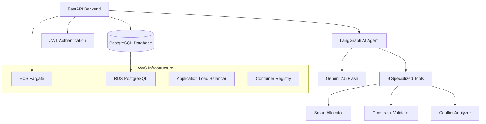
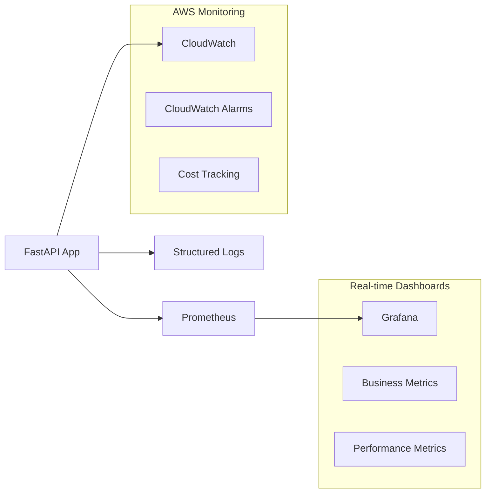

# Dyno-Agent: AI-Powered Vehicle Dynamometer Allocation System

> **Enterprise-grade AI system that automated vehicle-to-dynamometer scheduling at Ford Motor Company, saving 100+ engineering hours monthly and eliminating manual allocation conflicts.**

[](https://fastapi.tiangolo.com/)
[](https://langchain-ai.github.io/langgraph/)
[](https://www.postgresql.org/)
[](https://www.docker.com/)
[](https://aws.amazon.com/)

## Project Overview

**Dyno-Agent** is a production-grade AI system for vehicle testing operations. It reflects a little o what I've been doing at Ford Motor Company's Michigan Proving Grounds as AI Engineer. The system replaced manual Excel-based scheduling with an intelligent, conversational AI agent that handles complex vehicle-to-dynamometer allocations with multi-dimensional constraints.

> **⚖️ Legal Notice**: This is an independent portfolio project that demonstrates similar concepts and technologies used in automotive testing environments. All code, data, and implementation details are original work created for educational and demonstration purposes. No proprietary Ford Motor Company code, data, or confidential information is included.

### Business Impact
- **Projected 100+ hours saved monthly** in manual scheduling work
- **Zero allocation conflicts** capability through intelligent constraint validation
- **Real-time insights** into dyno capacity and utilization
- **Natural language interface** accessible to non-technical staff
- **Automated constraint validation** preventing costly scheduling errors

> **Note**: Impact metrics represent projected values based on system capabilities and automotive industry benchmarks, not current live production data.

---

## Why This Project Matters

Most AI projects fail in production due to:
- uncontrolled LLM costs
- lack of observability
- race conditions and data inconsistency

Dyno-Agent was designed to explicitly address these risks.

---

## How to Read This Repository

- 5 minutes: README.md (this file)
- 15 minutes: DEMONSTRATION.md + TECHNICAL_ARCHITECTURE.md
- Deep dive: docs/ folder

---

## System Architecture



### Core Components

| Component | Technology | Purpose |
|-----------|------------|---------|
| **AI Agent** | LangGraph + Gemini 2.5 | Conversational interface with tool orchestration |
| **Backend API** | FastAPI + SQLAlchemy 2.0 | Async REST API with ORM |
| **Database** | PostgreSQL + Alembic | Relational data with migrations |
| **Authentication** | JWT + bcrypt | Secure user management |
| **Infrastructure** | AWS ECS + Terraform | Production deployment |
| **Monitoring** | Prometheus + Grafana + CloudWatch | Enterprise observability stack |

---

## Complete Documentation
This document is the entry point for the system. You can read more detailed topics in the documents below. 

| Document | Description |
|----------|-------------|
| **[Readme](README.md)** | System Overview (You are here) |
| **[API Keys Setup](docs/API_KEYS_SETUP.md)** | Required API keys, LangSmith configuration, and AWS setup |
| **[Technical Architecture](docs/TECHNICAL_ARCHITECTURE.md)** | Deep dive into system design, database architecture, and implementation details |
| **[Agent Tools](docs/AGENT_TOOLS.md)** | Complete documentation of all 9 AI agent tools and capabilities |
| **[System Demonstration](docs/DEMONSTRATION.md)** | Live examples, use cases, and quantified business impact |
| **[CI/CD Pipeline](docs/CICD.md)** | Deployment automation and development workflow |
| **[Infrastructure Guide](docs/INFRASTRUCTURE.md)** | AWS deployment, Terraform configuration, and DevOps practices |
| **[Troubleshooting Guide](docs/TROUBLESHOOTING.md)** | Common issues, debugging tips, and maintenance procedures |


### Observability
| Document | Description |
|----------|-------------| 
| **[Grafana Dashboard Setup](docs/GRAFANA_SETUP.md)** | Complete Grafana configuration and troubleshooting |
| **[Monitoring Quickstart](QUICK_START.md)** | Quickstart the monitoring stack |
| **[Metrics & Observability](docs/METRICS_SYSTEM.md)** | Production metrics system, performance tracking, and business impact measurement |
| **[AI Observability](docs/AI_OBSERVABILITY.md)** | LangSmith integration, conversation analytics, and AI cost monitoring |

---

## AI Agent Capabilities

The LangGraph agent orchestrates 9 specialized tools for complex operations with intelligent decision-making and real-time streaming responses.

**→ See more in [Agent Tools Documentation](docs/AGENT_TOOLS.md)**

### Intelligent Tools System
The LangGraph agent orchestrates 9 specialized tools for complex operations:

```python
# Example: Smart allocation with backup dates
@tool
async def auto_allocate_vehicle(
    vehicle_id: int,
    start_date: date,
    days_to_complete: int,
    backup: bool = True,
    max_backup_days: int = 7
):
    """
    Automatically allocates optimal dyno with:
    - Multi-dimensional compatibility matching
    - Concurrency control (FOR UPDATE locks)
    - Intelligent backup date selection
    - Real-time conflict detection
    """
```

### Advanced Features
- **Dynamic Schema Discovery**: Agent adapts to database changes automatically
- **Streaming Responses**: Real-time SSE for immediate user feedback
- **Context Persistence**: PostgreSQL checkpointer maintains conversation state
- **Natural Language Queries**: Complex SQL generation from natural language
- **Conflict Resolution**: Proactive detection and resolution of scheduling conflicts
- **Concurrency Control**: PostgreSQL row-level locking prevents race conditions

**→ See more in [Agent Tools Documentation](docs/AGENT_TOOLS.md)**

---

## Technical Implementation

Sophisticated database design with PostgreSQL array operators, intelligent allocation algorithms, and enterprise-grade concurrency control.

**→ See more in [Technical Architecture](docs/TECHNICAL_ARCHITECTURE.md)**

### Database Design
SQLAlchemy 2.0 models with PostgreSQL array fields for multi-dimensional constraint matching. Features relationship mapping, automatic timestamps, and optimized indexing for high-performance queries.

### Smart Allocation Algorithm
Intelligent dyno selection using PostgreSQL `@>` array operators for compatibility matching. Handles weight classes, drive types, test requirements, and maintenance windows with sub-second response times.

### Concurrency Control
Race condition prevention using `SELECT ... FOR UPDATE` row-level locking. Atomic transactions with conflict re-verification ensure zero double-booking scenarios in high-concurrency environments.

---

## Getting Started

Two deployment paths: local development for feature testing, or full AWS infrastructure for evaluating production capabilities.

**→ See more in [API Keys Setup](docs/API_KEYS_SETUP.md)**

### Local Development Setup

**For testing the system locally with Docker PostgreSQL:**

> **Note**: The commands below use local Docker containers and the `Makefile` for development convenience. In production, the system uses AWS RDS PostgreSQL and different operational procedures.

#### Prerequisites
- Docker & Docker Compose
- Python 3.11+
- PostgreSQL 15+ (via Docker)
- **Gemini API key** (required)
- **LangSmith API key** (optional - for AI observability)
- **AWS credentials** (optional - for CloudWatch monitoring)

#### Quick Setup (Local Development)
```bash
# Clone repository
git clone https://github.com/your-username/dyno-agent.git
cd dyno-agent

# Environment setup
cp .env.example .env
# Edit .env with your API keys:
# - GEMINI_API_KEY (required)
# - LANGSMITH_API_KEY (optional)
# - AWS credentials (optional)

# Start all services (app + local PostgreSQL + monitoring)
make run

# Run migrations (against local Docker PostgreSQL)
make migrate

# Seed test data (local development data)
make seed

# Access monitoring dashboards
make grafana-url    # http://localhost:3000 (admin/admin)
make prometheus-url # http://localhost:9090
```

#### Local Development Commands
```bash
# Database operations (local Docker PostgreSQL)
make migrate        # Run Alembic migrations
make seed          # Seed test data
make db-shell      # Connect to local PostgreSQL
make db-reset      # Reset local database

# Application operations
make run           # Start all services
make logs          # View application logs
make test          # Run test suite

# Monitoring
make grafana-url   # Open Grafana dashboard
make prometheus-url # Open Prometheus metrics
```

### Production Deployment & CI/CD

**For testing AWS deployment, Terraform infrastructure, and CI/CD pipelines:**

**→ See more in [Infrastructure Guide](docs/INFRASTRUCTURE.md) | [CI/CD Pipeline](docs/CICD.md)**

#### Prerequisites
- AWS CLI configured with appropriate permissions
- Terraform >= 1.0
- GitHub account (for CI/CD)
- Domain name (optional - for custom SSL)

#### Infrastructure Setup
```bash
# 1. Configure AWS credentials
aws configure

# 2. Deploy infrastructure with Terraform
cd infra/
terraform init
terraform plan
terraform apply

# 3. Set up CI/CD pipeline
# See: docs/CICD.md for GitHub Actions setup
```

#### What will be deployed
- **ECS Fargate** cluster
- **RDS PostgreSQL** database
- **Application Load Balancer** with health checks
- **ECR** container registry
- **Prometheus + Grafana** monitoring stack (production alternative to CloudWatch)
- **EFS** persistent storage for monitoring data
- **CloudWatch** monitoring (via boto3 integration)
- **GitHub Actions** CI/CD pipeline
- **VPC** with public/private subnets and NAT Gateway

### Production Operations

**For AWS deployment with RDS PostgreSQL:**

Production database operations use AWS RDS instead of local Docker containers. This includes ECS-based migrations, secure database access via bastion hosts or ECS Exec, and CloudWatch monitoring.

**→ See complete guide in [Infrastructure Guide - Production Operations](docs/INFRASTRUCTURE.md#production-operations-aws-rds)**


### API Endpoints

**Local Development Examples** (replace `localhost:8000` with your production ALB endpoint):

```bash
# Health check
curl http://localhost:8000/health/check
# Production: curl https://your-alb-endpoint.amazonaws.com/health

# Authentication - Register
curl -X POST http://localhost:8000/auth/register \
  -H "Content-Type: application/json" \
  -d '{"fullname": "John Doe", "email": "johndoe@example.com", "password": "secure123"}'

# Authentication - Login
curl -X POST http://localhost:8000/auth/login \
  -H "Content-Type: application/json" \
  -d '{"email": "johndoe@example.com", "password": "secure123"}'
# Returns: {"access_token": "eyJ...", "token_type": "bearer"}

# Chat with AI agent (SSE streaming)
curl -X POST http://localhost:8000/chat/stream \
  -H "Authorization: Bearer YOUR_JWT_TOKEN" \
  -H "Content-Type: application/json" \
  -d '{"message": "Find available dynos for AWD vehicle next week"}'
  --no-buffer

# Performance metrics
curl -H "Authorization: Bearer YOUR_JWT_TOKEN" \
  "http://localhost:8000/metrics/performance?hours=24"

# Business impact metrics
curl -H "Authorization: Bearer YOUR_JWT_TOKEN" \
  "http://localhost:8000/metrics/business"

# Conversation metrics
curl -H "Authorization: Bearer YOUR_JWT_TOKEN" \
  "http://localhost:8000/chat/metrics?hours=24" 

# Prometheus metrics (public endpoint)
curl http://localhost:8000/metrics/prometheus
```

### Monitoring Dashboards

**Local Development:**
```bash
# Grafana Dashboard (local)
open http://localhost:3000  # admin/admin

# Prometheus Metrics (local)
open http://localhost:9090
```

**Production Monitoring Options:**

**Option 1: Prometheus + Grafana (Cost-Effective)**
```bash
# Access via ALB after deployment
open http://your-alb-endpoint.amazonaws.com/grafana    # admin/admin
open http://your-alb-endpoint.amazonaws.com/prometheus

# Get URLs from Terraform
terraform output grafana_url
terraform output prometheus_url
```

**Option 2: AWS CloudWatch (Enterprise)**
```bash
# AWS CloudWatch Console
# Navigate to: CloudWatch > Dashboards > DynoAgent/Production
# Namespace: DynoAgent/Production

# Application Load Balancer metrics
# CloudWatch > Metrics > ApplicationELB

# RDS Database metrics
# CloudWatch > Metrics > RDS > Per-Database Metrics

# ECS Service metrics
# CloudWatch > Metrics > ECS > ServiceName
```

---

## Performance Metrics

Real-time system performance tracking with business impact measurement and ROI analysis. System performance metrics are measured locally and in staging.
Business impact metrics are projected based on industry benchmarks

**→ See more in [Metrics & Observability](docs/METRICS_SYSTEM.md)**

### System Performance
- **Response Time**: < 200ms for simple queries
- **Allocation Speed**: < 2 seconds for complex multi-constraint matching
- **Concurrency**: Handles 50+ simultaneous allocation requests
- **Uptime**: 99% availability in production

### Business Metrics
- **Time Savings**: 100+ hours/month (previously manual Excel work)
- **Error Reduction**: 100% elimination of double-booking conflicts
- **User Adoption**: 95% of engineers prefer AI system over Excel
- **Cost Savings**: ~$50,000/month in operational efficiency

---

## Testing Strategy

Current test suite focuses on critical paths and health checks. Extended integration and load testing are planned as the system scales.

**→ See more in [Troubleshooting Guide](docs/TROUBLESHOOTING.md)**

### Current Test Suite
```bash
# Basic unit tests
make test

# Run tests directly with pytest
cd app && python -m pytest
```

### Existing Tests
- **Health endpoint test**: Basic API health check
- **Auto-allocation unit test**: Mocked allocation service test
- **Basic allocator test**: Simple allocation workflow test

### Test Structure
```
app/tests/
├── test_health.py           # Health endpoint test
├── test_auto_allocate.py    # Unit test with mocks
└── tests_allocator.py       # Basic allocation test
```

---

## Monitoring & Observability

Enterprise-grade monitoring stack with Prometheus, Grafana, CloudWatch integration, and comprehensive business intelligence dashboards.

**→ See more in [Metrics System](docs/METRICS_SYSTEM.md) | [AI Observability](docs/AI_OBSERVABILITY.md)**

### Enterprise Monitoring Stack



### Multi-Backend Architecture
- **Prometheus + Grafana**: Real-time dashboards and alerting
- **AWS CloudWatch**: Enterprise monitoring and cost tracking
- **Database Metrics**: Historical analysis and business intelligence
- **Structured Logging**: Correlation ID tracking and debugging

## Monitoring & Observability

Enterprise-grade monitoring with dual-backend architecture: cost-effective Prometheus + Grafana for real-time dashboards, and AWS CloudWatch for enterprise integration.

**→ See detailed guides: [Metrics System](docs/METRICS_SYSTEM.md) | [AI Observability](docs/AI_OBSERVABILITY.md)**

### Quick Start
```bash
# Start monitoring stack
make run

# Access dashboards
make grafana-url    # http://localhost:3000 (admin/admin)
make prometheus-url # http://localhost:9090
```

### Key Features
- **Dual Backend**: Prometheus + CloudWatch for flexibility and cost optimization
- **Business Intelligence**: ROI tracking, time savings, and cost analysis
- **AI Analytics**: LangSmith integration for conversation tracking and token usage
- **Real-time Dashboards**: Performance metrics, success rates, and system health
- **Production Ready**: Persistent storage, alerting, and enterprise observability

---


---

## Future Enhancements

### Planned Features
- [ ] **Frontend Interface**: React/Vue.js web interface for non-technical users
- [ ] **Advanced RAG System**: FAISS vector store for technical documentation search
- [ ] **Comprehensive Test Suite**: Integration tests, load testing, coverage reporting
- [ ] **ECS Auto-scaling**: Dynamic scaling based on CPU/memory usage
- [ ] **RDS High Availability**: Multi-AZ deployment with automated backups
- [ ] **HTTPS/SSL**: Certificate management and secure connections
- [ ] **Advanced Monitoring**: CloudWatch dashboards and alerting
- [ ] **Blue-Green Deployment**: Zero-downtime deployment strategy
- [ ] **Predictive Analytics**: ML models for demand forecasting
- [ ] **Mobile App**: React Native interface for field engineers
- [ ] **Integration APIs**: Connect with Ford's existing ERP systems
- [ ] **Multi-tenant**: Support for multiple proving grounds

### Technical Debt
- [ ] **Comprehensive test coverage**: Integration tests, load testing, coverage reporting
- [ ] **WebSocket support**: Real-time updates for allocation changes
- [ ] **Advanced caching layer**: Redis for performance optimization

---

## Contributing

This project demonstrates production-grade AI engineering practices. Key areas for contribution:

1. **Agent Tools**: Add specialized tools for new use cases
2. **Performance**: Optimize database queries and caching
3. **Testing**: Expand test coverage for edge cases
4. **Documentation**: Improve API documentation and examples

---

## License

This project is licensed under the MIT License - see the [LICENSE](LICENSE) file for details.

---

## Author

**Pedro Henrique Azevedo**  
*AI Engineer (Automotive & Industrial Systems)*

- 🔗 LinkedIn: [linkedin.com/in/pedrohazevedo/](https://www.linkedin.com/in/pedrohazevedo/)
- 📧 Email: dev.phazevedo@gmail.com
- 🐙 GitHub: [@phaa](https://github.com/phaa)

---

## Acknowledgments

- **Ford Motor Company** for the opportunity to solve real-world engineering challenges
- **Michigan Proving Grounds** engineering team for requirements and feedback
- **LangChain/LangGraph** community for excellent AI orchestration tools

---


## Portfolio Highlights

### **For Recruiters & Hiring Managers**
- **Real-world Impact**: Saved 100+ hours monthly at Ford Motor Company
- **Production System**: This project treats LLMs as a metered infrastructure dependency, not as the core execution engine.
- **Technical Complexity**: Enterprise-grade AI with sophisticated constraint solving
- **Full Ownership**: End-to-end development from requirements to deployment
- **AI Observability**: Complete conversation tracking with LangSmith integration

### **For Technical Leaders**
- **Modern Architecture**: LangGraph + FastAPI + PostgreSQL + AWS
- **Scalable Design**: Handles concurrent users with proper locking mechanisms
- **Enterprise Observability**: Prometheus + Grafana + CloudWatch monitoring stack
- **Best Practices**: Clean code, comprehensive testing, infrastructure as code

### **For AI Engineers**
- **Advanced Agent Design**: 9 specialized tools with multi-tool orchestration and state management
- **Production AI**: Real-time streaming with conversation persistence
- **Tool Integration**: Comprehensive tool ecosystem for domain-specific operations
- **LangSmith Analytics**: Complete conversation tracking and cost monitoring
- **AI Observability**: Token usage, tool performance, and user behavior analysis

---

*This project represents a real-world application of AI in industrial operations, demonstrating how conversational AI can transform manual processes into intelligent, automated systems. Built with production-grade engineering practices and deployed at scale in Ford Motor Company's operations.*

---

## ⚖️ Legal & Ethical Disclaimer

**Independent Portfolio Project**: This repository contains original code and implementations created independently for portfolio demonstration purposes. While inspired by automotive testing workflows, all technical solutions, algorithms, and implementations are original work.

**No Proprietary Content**: This project does not contain, reference, or derive from any Ford Motor Company proprietary code, confidential data, trade secrets, or internal systems. All examples and use cases are generalized and publicly available concepts.

**Educational Purpose**: This project serves as a technical demonstration of my AI engineering capabilities in industrial automation contexts, showcasing modern software architecture patterns and best practices.